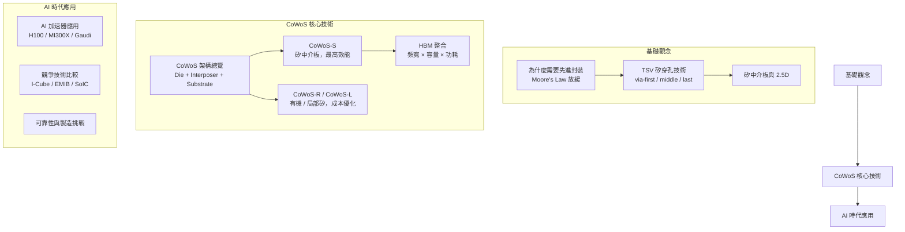

# 全書地圖

## 各章節一句話摘要

| 章節 | 核心問題 |
|------|---------|
| [為什麼需要先進封裝](01-why-advanced-packaging.md) | 製程微縮放緩後，封裝如何成為新的效能引擎？ |
| [TSV 基礎](02-tsv-basics.md) | 矽穿孔怎麼做？三種形成方式有何差異？ |
| [矽中介板與 2.5D](03-silicon-interposer-2d5.md) | 中介板解決什麼問題？為何比有機基板好？ |
| [CoWoS 架構總覽](04-cowos-overview.md) | CoW + WoS 兩步驟流程是什麼？ |
| [CoWoS-S](05-cowos-s.md) | 第一代到第五代，面積如何從 830 擴展到 2500 mm²？ |
| [CoWoS-R / CoWoS-L](06-cowos-r-l.md) | 有機中介板與局部矽中介板的設計取捨 |
| [HBM 整合](07-hbm-integration.md) | HBM 為何需要 CoWoS？頻寬從何而來？ |
| [AI 加速器應用](08-cowos-ai-hpc.md) | H100 裡的 CoWoS 長什麼樣子？ |
| [競爭技術比較](09-competing-technologies.md) | 三星、Intel 的對應方案有何不同？ |
| [可靠性與製造](10-reliability-manufacturing.md) | 良率、熱應力、翹曲——量產的三大挑戰 |
