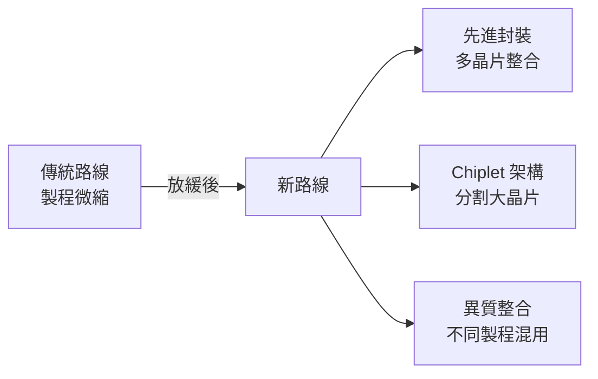
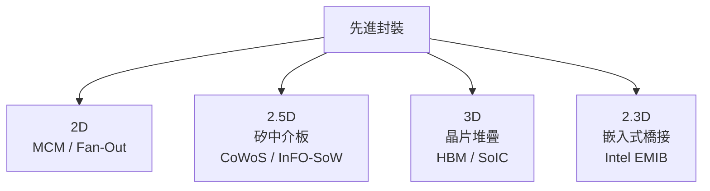

# 為什麼需要先進封裝

## Moore's Law 的放緩

傳統半導體效能提升依靠「製程微縮」：每隔約 18–24 個月，電晶體密度翻倍，同時功耗與成本下降。這條路在 7nm 以下開始遇到根本性障礙：

- **物理極限**：量子穿隧效應在閘極長度低於 5nm 時難以抑制
- **光刻成本**：EUV 光罩與設備成本呈指數上升
- **良率壓力**：晶片面積愈大，良率愈低（Poisson 缺陷分布）

## 封裝的角色轉變

過去，封裝是製程完成後的「後處理」，目標只是保護晶片並提供 I/O 接腳。現在，封裝本身成為設計的一部分：

| 舊觀念 | 新觀念 |
|--------|--------|
| 封裝 = 保護殼 | 封裝 = 互連架構 |
| 最小化封裝成本 | 封裝決定系統效能 |
| 單晶片封裝 | 多晶片異質整合 |
| 封裝在設計後期決定 | 封裝與晶片協同設計 |

## 先進封裝的分類

以「整合維度」分類，目前業界常用：

**2.5D 封裝（CoWoS 所屬）** 的核心優勢：
- 多個 Die 並排放置於同一矽中介板上
- 透過中介板上的細間距再分佈層（RDL）互連
- 避免垂直堆疊的散熱問題
- 每個 Die 可使用最適合的製程節點

## 為何 AI 計算特別需要先進封裝

AI 訓練與推理的瓶頸早已從「計算」移到「記憶體頻寬」。將 HBM（High Bandwidth Memory）與 GPU/TPU 放在同一個 CoWoS 封裝上，頻寬可達傳統 GDDR 的 5–10 倍，這是 H100、MI300X 等 AI 加速器效能躍升的根本原因。

> 下一頁：[TSV 矽穿孔技術基礎](02-tsv-basics.md)
