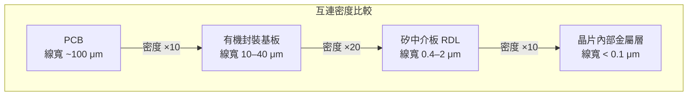
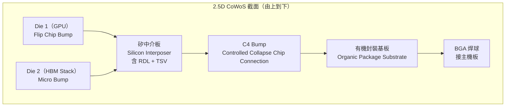

# 矽中介板與 2.5D 整合

## 什麼是矽中介板

矽中介板（Silicon Interposer）是一片「被動」的矽晶片——上面沒有電晶體，只有多層細間距的金屬再分佈層（RDL, Redistribution Layer）。它扮演「橋接板」的角色，讓多個 Die 能以極細的線寬互連，同時透過 TSV 連接到下方的有機封裝基板。

## 為何不直接用有機基板互連

有機基板（PCB 或封裝基板）的線寬通常只能做到 10–40 μm，而矽中介板可以做到 **0.4–2 μm**。當 GPU 與 HBM 之間需要數千條平行匯流排，只有矽中介板的線寬才能容納。

## 2.5D 架構的完整堆疊

「2.5D」這個名稱的由來：Die 沒有真正堆疊（那是 3D），而是並排在中介板上，在垂直方向只有一層 Die，故稱「介於 2D 和 3D 之間」。

## 矽中介板的製程

矽中介板由 TSMC 晶圓廠製造，使用標準半導體製程（但不做電晶體）：

1. 在矽晶圓上做 TSV（Via-Last，從背面薄化後形成）
2. 在正面做多層 RDL（銅金屬 + 低介電常數介電層）
3. 晶圓切割後，將 GPU Die 與 HBM 覆晶接合（Flip Chip）到中介板正面
4. 整體再接合到有機封裝基板

## 矽中介板 vs 有機中介板

| 特性 | 矽中介板（CoWoS-S） | 有機中介板（CoWoS-R） |
|------|------------------|------------------|
| 互連線寬 | 0.4–2 μm | 2–10 μm |
| 成本 | 高 | 較低 |
| 熱膨脹係數（CTE） | 2.6 ppm/°C（接近 Die） | 15–20 ppm/°C |
| 翹曲風險 | 低 | 較高 |
| 適用場景 | HPC、AI 旗艦 | 成本敏感應用 |

> 下一頁：[CoWoS 架構總覽](04-cowos-overview.md)
