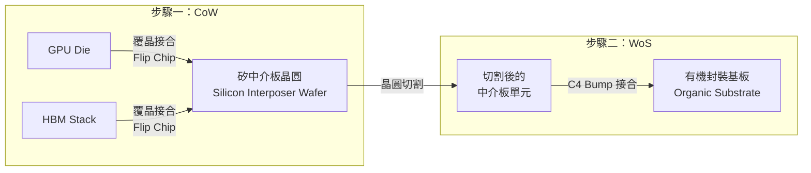
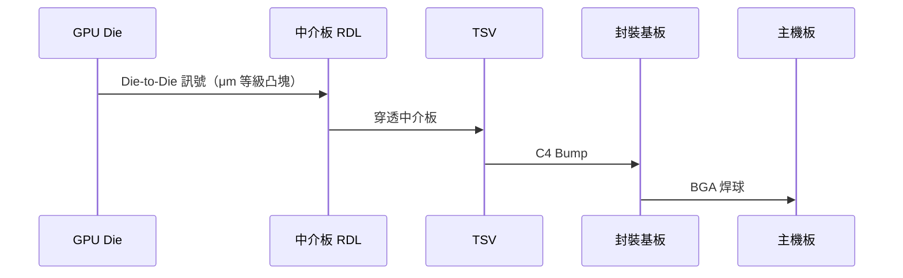

# CoWoS 架構總覽

## 名稱的意義

**CoWoS = Chip-on-Wafer-on-Substrate**，描述的正是製造流程的兩個核心步驟：

- **CoW（Chip on Wafer）**：將 GPU Die、HBM 等晶片直接覆晶接合到矽中介板晶圓上
- **WoS（Wafer on Substrate）**：再將含有晶片的中介板晶圓切割後，接合到有機封裝基板

## 三大組成元素

### 1. Die（晶片）
放在中介板正面，可以是：
- **Compute Die**：GPU、TPU、CPU、FPGA（用最先進製程節點）
- **Memory Die**：HBM 堆疊（通常 4–12 層 DRAM + Base Die）

### 2. Silicon Interposer（矽中介板）
- 面積通常比 Die 大，需容納所有 Die
- 含多層 RDL（0.4–2 μm 線寬）負責 Die-to-Die 橫向互連
- 含 TSV 負責縱向訊號穿透到基板

### 3. Package Substrate（封裝基板）
- 有機材料（類似 PCB）
- 提供電源分配與對外 BGA 接腳
- 尺寸通常 50–80 mm 見方

## 訊號路徑

## CoWoS 三個變體

| 變體 | 中介板材料 | 線寬 | 定位 |
|------|----------|------|------|
| **CoWoS-S** | 矽（Silicon） | 0.4–2 μm | 旗艦效能，H100 / B100 |
| **CoWoS-R** | 有機（Organic RDL） | 2–5 μm | 成本優化版 |
| **CoWoS-L** | 局部矽嵌入有機板 | 混合 | 兼顧成本與密度 |

> 各變體的詳細說明見 [CoWoS-S](05-cowos-s.md) 與 [CoWoS-R / CoWoS-L](06-cowos-r-l.md)。
