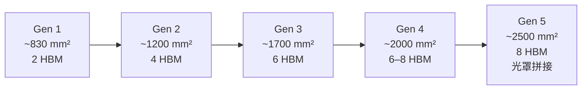

# CoWoS-S：矽中介板版本

CoWoS-S 是 CoWoS 家族中效能最高、技術最成熟的版本，也是 NVIDIA H100、H200、B100 等 AI 旗艦加速器採用的方案。「S」代表 Silicon（矽中介板）。

## 技術演進：從第一代到第五代

TSMC 持續擴大中介板面積以支援更多 HBM 堆疊：

面積擴大的關鍵突破是**光罩拼接（Mask Stitching）技術**：單一光罩最大約 830 mm²，超過這個面積需要多片光罩拼接，而拼接處的對準精度是核心挑戰。

## 核心技術細節

### RDL 層數與線寬
- 典型 RDL：4–6 層金屬
- 最細線寬：~0.4 μm（局部互連層）
- 全局路由層：~2 μm

### Die-to-Die 互連凸塊
- GPU 與 HBM 之間透過 **Micro Bump**（間距 ~55 μm）連接到中介板
- 中介板下方透過 **C4 Bump**（間距 ~130–150 μm）連接到封裝基板

### TSV 規格
- 直徑：~10 μm
- 深度：~100 μm（深寬比 10:1）
- 間距：~40–50 μm

## CoWoS-S 的應用產品

| 產品 | GPU Die | HBM | 中介板面積（估計） |
|------|---------|-----|-----------------|
| NVIDIA H100 SXM | GH100（4nm） | 6× HBM3 | ~2100 mm² |
| NVIDIA H200 SXM | GH100（4nm） | 6× HBM3e | ~2100 mm² |
| AMD MI300X | 8× Compute + 4× IO Die | 8× HBM3 | ~3000 mm² |

## 效能優勢

使用 CoWoS-S 相比傳統封裝方式的效能提升：

- **Die-to-Die 頻寬**：>1 TB/s（GPU↔HBM，短距離低阻抗）
- **功耗效率**：HBM 的每 bit 傳輸功耗約為 GDDR6 的 1/5
- **延遲**：比 GDDR 低 30–50%

> 相關：[HBM 整合](07-hbm-integration.md) | [AI 加速器應用](08-cowos-ai-hpc.md)
