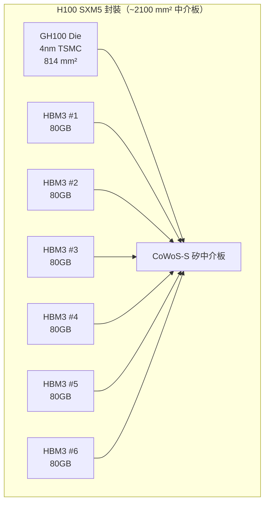
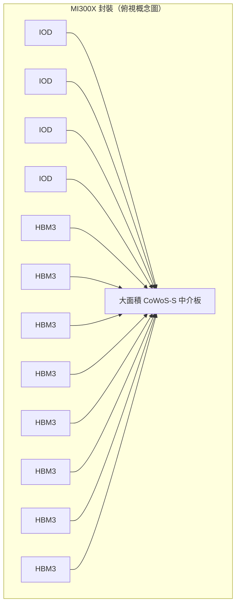
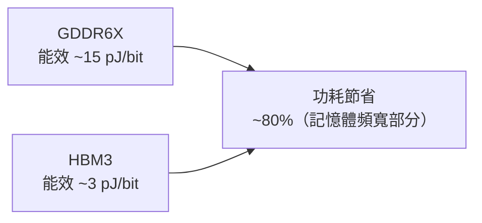

# CoWoS 在 AI 加速器中的角色

CoWoS 不只是封裝技術，它是決定 AI 加速器效能天花板的核心架構選擇。以下從具體產品角度解析 CoWoS 如何在系統層面發揮作用。

## NVIDIA H100：CoWoS-S 的代表作

- GPU Die 居中，6 顆 HBM3 環繞兩側
- 每顆 HBM3 透過中介板 RDL 與 GPU 的 HBM PHY 直連
- 總頻寬：3.35 TB/s，是前代 A100（2 TB/s）的 1.7 倍

## AMD MI300X：最激進的 CoWoS 應用

AMD MI300X 把 Chiplet 架構推到極致：

- **8 個 Compute Die（CCD）**：5nm，分兩層堆疊（3D 結構）
- **4 個 IO Die（IOD）**：6nm，負責記憶體控制器與 PCIe
- **8 顆 HBM3**：共 192 GB 容量
- **中介板面積**：~3,000 mm²（需多片光罩拼接）

## CoWoS 為 AI 帶來的系統級影響

### 1. 大模型推理：記憶體容量決定模型大小
- GPT-4 等大型模型需要數百 GB 顯存
- CoWoS 讓每顆加速器可配置 80–192 GB HBM
- 比傳統方案多 4–8 倍容量

### 2. 訓練效率：頻寬決定 Gradient 同步速度
- 在 Tensor Parallelism 中，每個 AllReduce 操作需要高頻寬
- CoWoS 的高 HBM 頻寬直接縮短等待時間

### 3. 功耗效率：HBM 的能效遠優於 GDDR

## 供應鏈瓶頸

CoWoS 目前是 AI 晶片的**最大供應瓶頸**之一：

- 全球能製造大面積 CoWoS 的廠商幾乎只有 TSMC
- 2023–2024 年 TSMC CoWoS 產能嚴重供不應求
- 每塊大面積中介板的良率挑戰使產能擴充困難

> 相關：[可靠性與製造挑戰](10-reliability-manufacturing.md)
