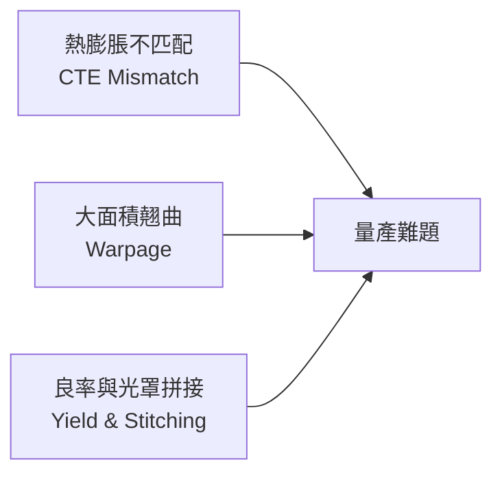
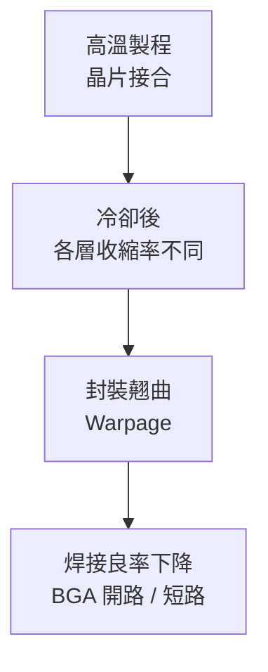

# 可靠性與製造挑戰

CoWoS 在物理尺度上把多個截然不同的材料強迫接合在一起。可靠性問題本質上來自這些材料特性的不一致。

## 三大核心挑戰



## 1. 熱膨脹係數（CTE）不匹配

封裝內各層材料加熱時膨脹速率不同：

| 材料 | CTE（ppm/°C） |
|------|-------------|
| 矽（Die / 中介板） | 2.6 |
| 銅（TSV / RDL） | 17 |
| 有機封裝基板 | 15–20 |
| PCB | 14–17 |

每次開機 / 關機就是一次熱循環，材料反覆膨脹收縮，焊點與凸塊承受剪切應力。長期下來導致：
- Micro Bump 裂縫
- TSV 銅柱剝離
- 底部填充膠（Underfill）失效

**緩解方式**：
- Underfill 填充 Die 下方空間，分散應力
- 使用低 CTE 封裝基板（2–5 ppm/°C，接近矽）
- 精確控制回焊溫度曲線

## 2. 大面積翹曲

矽中介板面積超過 2000 mm² 時，翹曲問題顯著：



- 翹曲量若超過 100–200 μm，BGA 回焊時焊球無法同時接觸基板
- TSMC Gen 5 CoWoS（2500 mm²）對翹曲管控要求極為嚴格
- 解法：複合材料補強板、應力補償層、特殊晶圓固持夾具

## 3. 良率：大面積的物理代價

缺陷密度（D₀）決定晶片良率，而面積愈大，良率愈低：

```
良率（Y）≈ exp(−D₀ × A)
```

矽中介板面積 2500 mm² 時，即使缺陷密度極低（0.01 個/cm²），良率也只有：

```
Y ≈ exp(−0.01 × 25) ≈ 78%
```

這意味每 100 片中介板有 22 片報廢，而每片大面積中介板成本高昂。

**光罩拼接的額外風險**：
- 多片光罩拼接處若對準偏移 >10 nm，RDL 導線斷路
- 每增加一段拼接，額外引入良率損失

## 4. 可靠性驗證標準

業界以 **JEDEC** 與 **IPC** 標準驗證 CoWoS 封裝可靠性：

| 測試 | 條件 | 目標 |
|------|------|------|
| 溫度循環（TC） | −55°C ↔ 125°C，1000 次 | 焊點無裂縫 |
| 高溫高濕（HAST） | 130°C / 85% RH，96 小時 | 無腐蝕 / 開路 |
| 落下測試（Drop） | 衝擊加速度 1500 G | Bump 無脫落 |
| 電遷移（EM） | 高電流密度長時間 | 銅線無斷路 |

> 本頁參考：Lin et al. (2013) IEEE ECTC、Chuang et al. (2013) IEEE ECTC，詳見[學習資源](appendix-references.md)。
