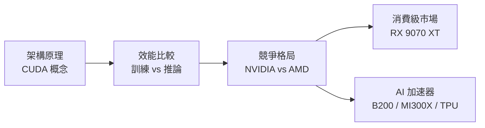

# GPU 完整學習指南

本書從架構原理出發，帶你理解 GPU 的運作方式，再逐步拆解各家廠商的競爭策略、消費級市場格局，以及 AI 加速器的取捨邏輯。

## 建議學習路徑

最建議從「**架構原理**」的 [CUDA 程式設計模型](architecture/cuda-model.md) 入手，建立概念後再看效能比較，這樣看數字才能理解背後的意義。

## 五大主題

| 主題 | 核心問題 |
|------|---------|
| [架構原理](architecture/gpu-fundamentals.md) | GPU 為什麼比 CPU 更擅長平行計算？ |
| [效能比較](performance/training-benchmarks.md) | 訓練與推論的瓶頸分別在哪裡？ |
| [競爭格局](competitive/nvidia-moat.md) | NVIDIA 的護城河究竟是硬體還是生態？ |
| [消費級市場](consumer/rx9070xt.md) | AMD 如何在 2025 年打破 NVIDIA 的定價壟斷？ |
| [AI 加速器](ai-accelerators/tradeoffs.md) | 不同加速器在不同任務上各有什麼優勢？ |

## 核心洞察

> NVIDIA 的護城河不只是硬體，而是生態系：超過 400 萬名開發者、3,000 個以上的 GPU 加速應用程式，以及 40,000 家公司使用 CUDA。即便 AMD 的 ROCm 7.0 有顯著改善，第三方測試顯示 NVIDIA 在訓練工作負載上仍領先 AMD 約 2–3 倍，原因是**軟體成熟度**，而非硬體本身。
