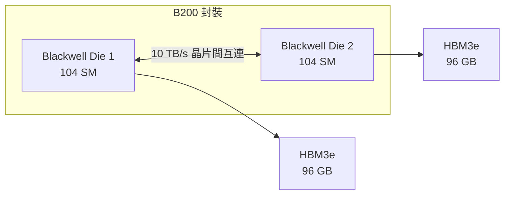
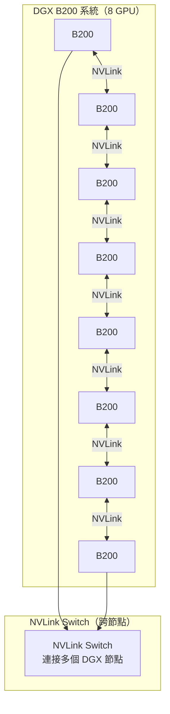

# NVIDIA B200 與 NVLink

B200 是 NVIDIA 2024 年發布的 Blackwell 架構旗艦 AI 加速器，設計目標是主導下一代超大規模 LLM 訓練。

## 核心規格

| 規格 | B200 SXM | H100 SXM | 提升 |
|------|---------|---------|------|
| 架構 | Blackwell | Hopper | — |
| FP8 TFLOPS | ~18,000 | 3,958 | ~4.5× |
| FP4 TFLOPS | ~36,000 | 不支援 | 新增 |
| HBM3e 容量 | 192 GB | 80 GB | 2.4× |
| 記憶體頻寬 | 8.0 TB/s | 3.35 TB/s | 2.4× |
| NVLink 頻寬 | 1.8 TB/s | 900 GB/s | 2× |
| TDP | ~1,000 W | 700 W | +43% |

## B200 的架構創新

**雙晶片封裝（Multi-Die）**

B200 由兩個 Blackwell Die 透過高速互連（10 TB/s）封裝在單一封裝內，對軟體層呈現為單一 GPU。這讓 B200 的計算密度遠超單晶片設計的物理極限。

**Transformer Engine 升級**

- 支援 FP4 精度（業界首款量產 GPU）
- 動態在 FP4 / FP8 / FP16 間切換，大幅提升 Token 生成速度
- 推論效能比 H100 提升約 5×

## NVLink 5.0：超大規模訓練的基礎

8 個 B200 透過 NVLink 5.0 形成 1.4 TB/s 的 All-to-All 頻寬，讓 Tensor Parallelism 的通訊成本幾乎可忽略。

## GB200 NVL72：超大規模叢集

GB200 NVL72 是 NVIDIA 為超大規模訓練推出的機架級系統：

- 36 個 Grace CPU + 72 個 B200 GPU
- NVLink 互連所有 GPU
- 功耗：120 kW / 機架

這是 OpenAI、Meta、Google 等大型 AI 實驗室的主要採購目標。

## 延伸閱讀

- [平行運算原理](../architecture/parallel-computing.md) — NVLink 如何改變多 GPU 擴展
- [加速器取捨總覽](tradeoffs.md) — B200 適合哪些場景
