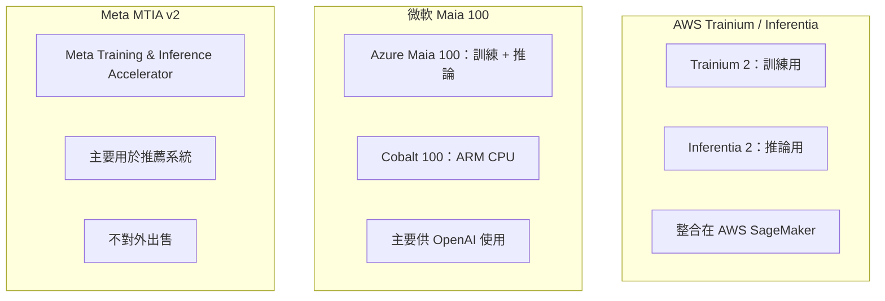
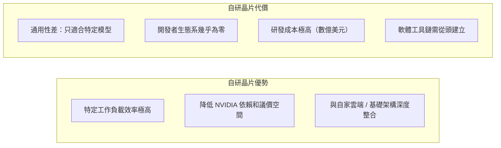

# 自研晶片：AWS、微軟、Meta

大型科技公司投入自研 AI 晶片的核心動機只有一個：**以犧牲通用性換取特定工作負載的效率，並降低對 NVIDIA 的依賴。**

## 三家公司的策略比較

## AWS Trainium 2

**設計目標**：在 AWS 上訓練大型 LLM，成本比 NVIDIA GPU 低 40%（AWS 官方宣稱）

- 支援 FP8 / BF16 / FP32 精度
- 透過 **NeuronSDK** 整合 PyTorch / JAX
- NeuronSDK 自動把 PyTorch 模型編譯到 Trainium 上執行（類似 XLA）
- 2024 年：Amazon 內部訓練 Titan 系列模型使用 Trainium

**局限**：NeuronSDK 對非標準算子的支援有限，客製化困難。

## 微軟 Maia 100

**設計目標**：供 Microsoft Azure 和 OpenAI 使用，降低 NVIDIA 依賴

- 2024 年在 Azure 開始小規模部署
- 主要用於 GPT-4 系列模型的推論服務
- 微軟同時繼續大量採購 NVIDIA GPU，Maia 是補充而非替代

**現況**：未對外開放，細節規格未公開。屬於 Azure 基礎架構投資，不是商業加速器。

## Meta MTIA v2（Meta Training and Inference Accelerator）

**設計目標**：Meta 內部的推薦系統（Ranking 模型）和 LLM 推論

- v1（2023）：針對 Ranking 模型設計，效率比 GPU 高
- v2（2024）：擴展到 LLM 推論（LLaMA 系列）
- **不對外出售**，純粹為 Meta 自用

Meta 的推薦系統每天為數十億用戶服務，對計算效率的極致追求驅動了自研。

## 自研晶片的共同取捨

## 對 NVIDIA 的影響

這些自研晶片的長期意義在於：

1. **定價談判籌碼**：「我們有自己的晶片」讓大型客戶在採購 NVIDIA 時更有談判空間
2. **特定工作負載分流**：推薦系統、批次推論可以用自研晶片處理，為 NVIDIA GPU 留下更高價值工作
3. **長期技術路線**：若 CUDA 替代生態（JAX/XLA、Triton）成熟，切換成本會降低

## 延伸閱讀

- [Google TPU v5p](tpu-v5p.md) — 最成熟的自研加速器案例
- [軟體生態決定勝負](../competitive/software-ecosystem.md) — 打破 CUDA 壟斷的策略
