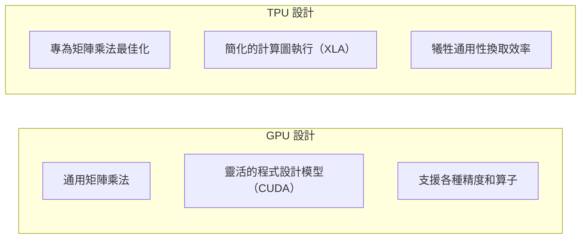
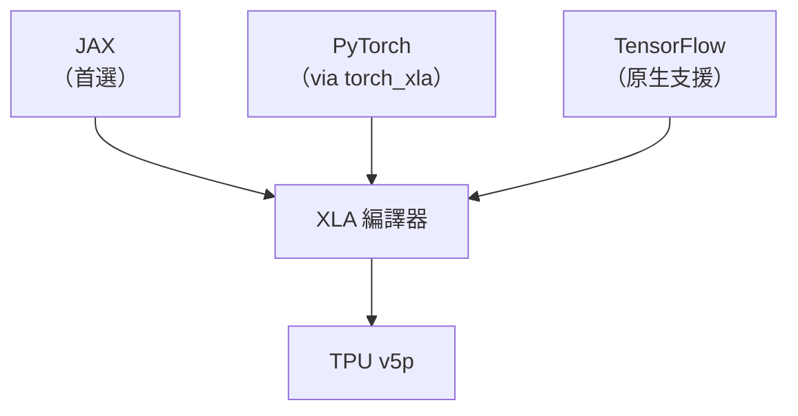

# Google TPU v5p

Google TPU（Tensor Processing Unit）是業界最長青的 AI 加速器，從 2016 年就開始在 Google 內部使用。TPU v5p 是 2023 年發布的最新版本，深度整合在 GCP 基礎架構中。

## TPU 設計哲學

TPU 與 GPU 的根本差異：

TPU 的核心是 **Systolic Array**（脈動陣列）：一種固定資料流方向的矩陣乘法電路，不需要把運算元載入快取，資料直接在陣列中流動，記憶體存取開銷極低。

## TPU v5p 規格

| 規格 | TPU v5p | TPU v4 | 備注 |
|------|---------|--------|------|
| 架構 | — | — | Google 自研 |
| BF16 TFLOPS | 918 | 275 | 3.3× 提升 |
| HBM 容量 | 95 GB | 32 GB | 3× 提升 |
| ICI 頻寬 | 4,800 Gbps | 1,200 Gbps | 4× 提升（晶片間） |
| 雲端可用 | 僅 GCP | 僅 GCP | |

## ICI：TPU 的互連優勢

**Inter-Chip Interconnect（ICI）** 是 TPU 最獨特的特性：

- 數千顆 TPU 透過 ICI 直接相連，形成超大規模計算網格
- ICI 頻寬遠高於 PCIe，接近 NVLink 水準
- 不需要昂貴的 InfiniBand 網路交換器

Google 可以把 4,096 顆 TPU v5p 串成一個 **TPU Pod**，All-to-All 通訊效率極高。

## 使用 TPU 的工具鏈

**JAX + TPU 是 Google 內部的黃金組合**，Gemini 系列模型就是用這套工具訓練的。

## 優勢與局限

| 優點 | 限制 |
|------|------|
| 與 GCP / BigQuery 深度整合 | 僅在 GCP 上可用 |
| JAX 生態支援最完善 | PyTorch 支援仍有限制 |
| 超大規模 Pod 通訊效率高 | 自訂算子開發困難 |
| Google 自行維護，成本有優勢 | 無法帶到本地環境 |

## 延伸閱讀

- [自研晶片：AWS、微軟、Meta](custom-silicon.md) — 其他科技巨頭的類似策略
- [加速器取捨總覽](tradeoffs.md) — 何時考慮 TPU
