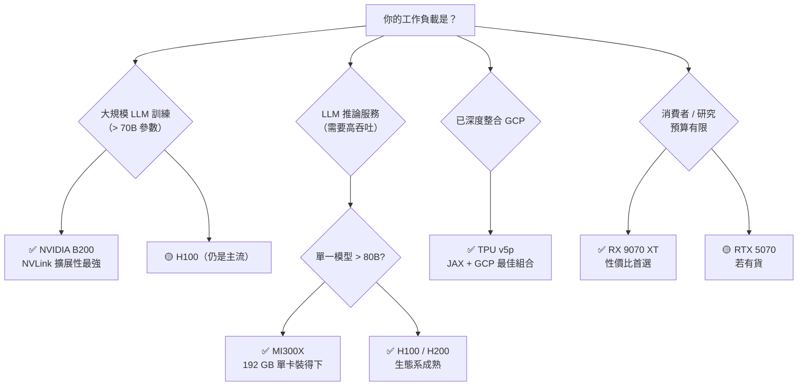
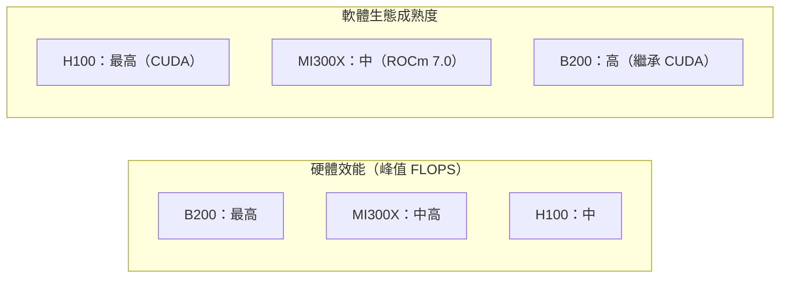

# 加速器取捨總覽

不同加速器在不同任務上各有優勢。本頁提供決策框架，幫助你在面對不同工作負載時做出正確選擇。

## 決策矩陣

## 各加速器一頁摘要

| 加速器 | 最強場景 | 主要限制 | 理由 |
|-------|---------|---------|------|
| NVIDIA B200 | 大規模訓練 | 功耗 1,000W、價格高 | NVLink 5.0 + FP4 + 成熟 CUDA |
| NVIDIA H100 | 訓練 + 推論（通用） | 80 GB 限制大模型 | 生態最成熟，問題最少 |
| AMD MI300X | 大模型推論 | ROCm 軟體不成熟 | 192 GB HBM，Memory Bound 場景佔優 |
| Google TPU v5p | GCP 上的 LLM 訓練 | 僅限 GCP，通用性差 | JAX 整合、ICI 互連效率 |
| AWS Trainium 2 | AWS 上的訓練 | NeuronSDK 限制多 | 成本較低，適合特定模型 |
| 微軟 Maia 100 | Azure 推論（OpenAI） | 未對外開放 | 降低 OpenAI 服務成本 |
| Meta MTIA v2 | 推薦系統 + 推論 | 不對外出售 | Meta 自用 |
| RX 9070 XT | 消費級高效能遊戲 | 光追仍落後 DLSS | 性價比最高，供應穩定 |

## 軟體成熟度 vs 硬體效能

**關鍵洞察**：B200 繼承了 CUDA 生態，所以同時擁有最高硬體效能和成熟軟體。MI300X 硬體競爭力強但軟體拖累了實際效能。

## 什麼情況下考慮 AMD / 自研晶片

- **推論成本敏感**：大模型推論，MI300X 的 TCO 可能更低
- **雲端鎖定可接受**：在 AWS 長期運行，Trainium 有成本優勢
- **JAX 優先**：Google TPU v5p 是 JAX 的最佳搭檔
- **消費級預算**：RX 9070 XT 是目前最佳性價比

## 延伸閱讀

- [NVIDIA B200 與 NVLink](b200.md) — 訓練旗艦的詳細分析
- [AMD MI300X 推論優勢](mi300x.md) — 推論場景的競爭力
- [性價比分析](../performance/cost-analysis.md) — TCO 的完整計算邏輯
