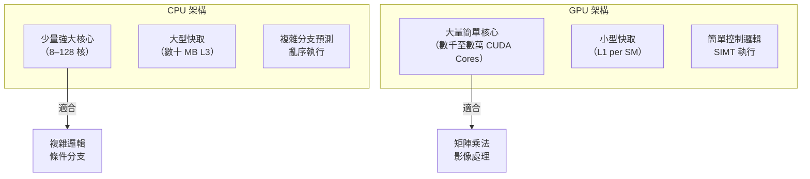
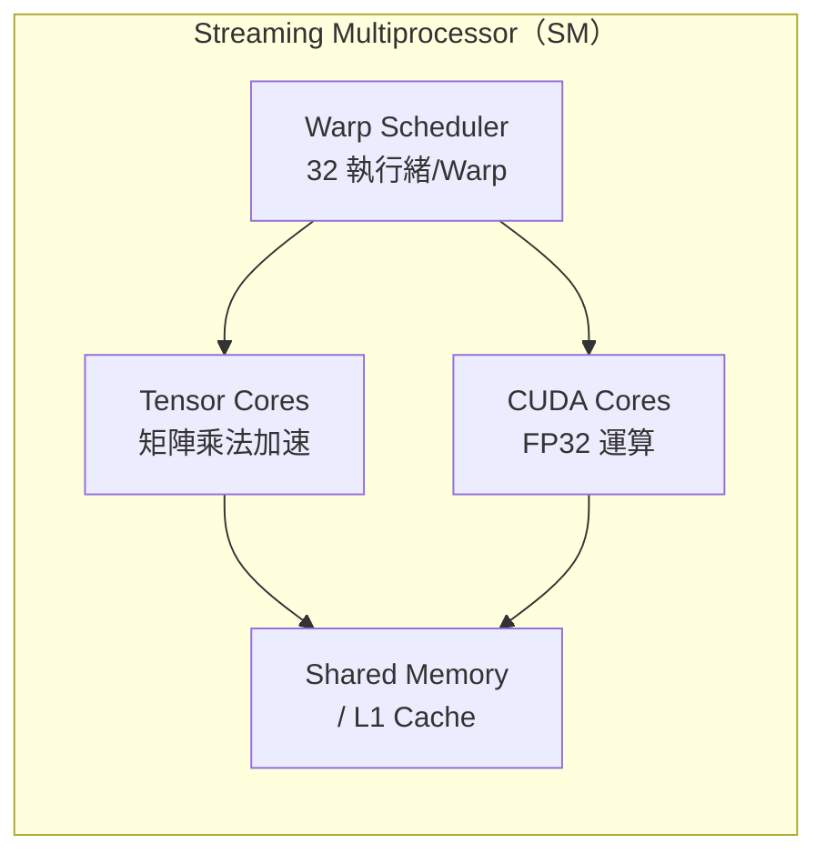

# GPU 基礎架構

GPU（圖形處理單元）與 CPU 的設計哲學截然不同：CPU 針對**低延遲的串行任務**最佳化，GPU 則針對**高吞吐量的平行任務**最佳化。

## CPU vs GPU 核心差異

## SM：GPU 的基本執行單元

現代 NVIDIA GPU 由多個 **Streaming Multiprocessor（SM）** 組成，每個 SM 包含：

- **CUDA Cores**：執行 FP32 運算的最小單位
- **Tensor Cores**：專為矩陣乘法設計，支援 FP16/BF16/INT8
- **Shared Memory / L1 Cache**：SM 內部的高速共享記憶體
- **Register File**：每個執行緒的私有暫存器
- **Warp Scheduler**：管理 32 個執行緒（1 Warp）的排程

## Hopper 架構（H100）重點

NVIDIA H100 基於 Hopper 微架構，關鍵創新包括：

- **Transformer Engine**：動態在 FP8 和 FP16 之間切換精度，提升 LLM 訓練效率
- **NVLink 4.0**：GPU 間頻寬達 900 GB/s（vs PCIe 5.0 的 128 GB/s）
- **HBM3**：80 GB 高頻寬記憶體，頻寬 3.35 TB/s

## Blackwell 架構（B200）重點

2024 年發布的 B200 進一步強化：

- 雙晶片封裝（2× 連接成一個 GPU）
- **NVLink 5.0**：1.8 TB/s 互連頻寬
- FP4/FP8 混合精度訓練
- 推論效能比 H100 提升約 5×

## 延伸閱讀

- [CUDA 程式設計模型](cuda-model.md) — 如何把任務映射到這些核心上
- [記憶體層次結構](memory-hierarchy.md) — 為什麼記憶體頻寬常常才是瓶頸
