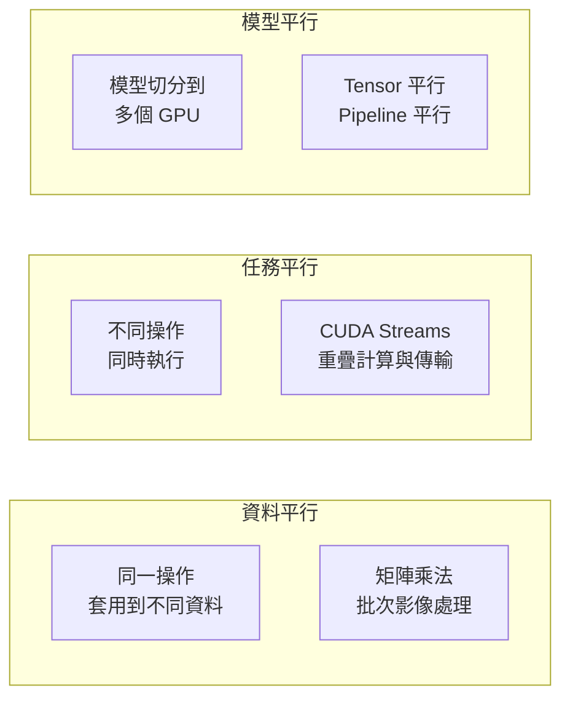

# 平行運算原理

GPU 的設計哲學是**用延遲換吞吐量**：接受單一指令的延遲較高，換取同時執行數萬個執行緒的總吞吐。

## 平行運算的三個層次

## CUDA Stream：重疊計算與記憶體傳輸

預設情況下，CUDA 操作在 Default Stream 中串行執行。使用多個 Stream 可以讓：

- Kernel A 執行時，同步把下一批資料從 CPU 傳到 GPU
- 兩個獨立的 Kernel 同時執行（不同 SM）

這是訓練框架（PyTorch、JAX）大量使用的底層最佳化。

## 多 GPU 擴展策略

大型 LLM 訓練無法放進單一 GPU，需要切分模型：

| 策略 | 切分方式 | 通訊需求 |
|------|---------|---------|
| 資料平行（DDP） | 每 GPU 複製完整模型，切分 Batch | All-Reduce 梯度 |
| Tensor 平行 | 切分每層的矩陣 | All-Reduce（每層後） |
| Pipeline 平行 | 不同 GPU 負責不同層 | P2P（層間傳遞） |
| ZeRO（DeepSpeed） | 分散儲存參數 / 梯度 / Optimizer State | All-Gather + Reduce-Scatter |

## NVLink 為何關鍵

多 GPU 訓練的效率取決於 GPU 間通訊頻寬：

- **PCIe 5.0**：128 GB/s（雙向，伺服器級別）
- **NVLink 4.0**（H100）：900 GB/s
- **NVLink 5.0**（B200）：1.8 TB/s

NVLink 讓 8 個 GPU 的 All-Reduce 操作快 7–10 倍，直接影響大規模訓練的效率。

## 延伸閱讀

- [NVIDIA B200 與 NVLink](../ai-accelerators/b200.md) — NVLink 在超大規模訓練中的作用
- [訓練效能基準](../performance/training-benchmarks.md) — 這些原理如何反映在實際數字上
