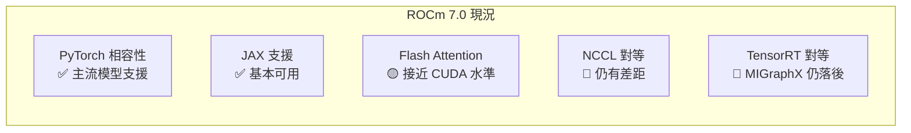
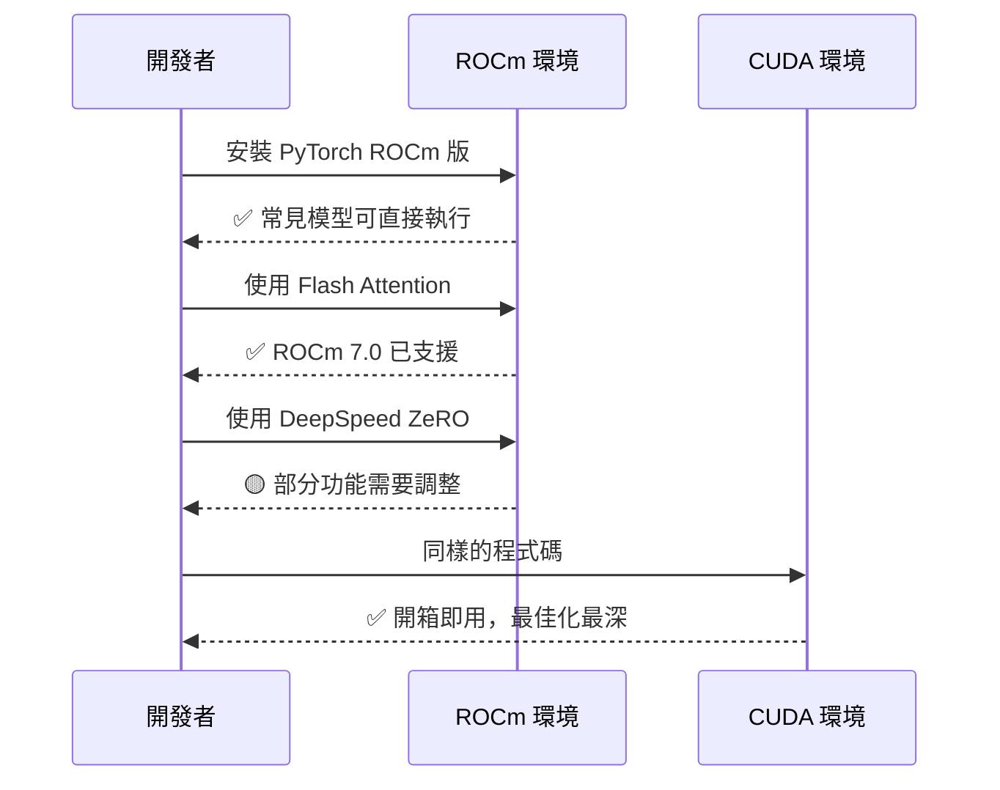

# AMD ROCm 7.0 的挑戰

ROCm（Radeon Open Compute）是 AMD 對抗 CUDA 生態的開源策略。2025 年發布的 ROCm 7.0 帶來了顯著改善，但與 CUDA 的差距仍在。

## ROCm 7.0 的主要改進

- **HipBLAS 更新**：GEMM（矩陣乘法）效率提升約 30–40%
- **MIOpen 改進**：Flash Attention 2 的 ROCm 實作接近 CUDA 水準
- **PyTorch ROCm 後端**：更完整的算子支援，常見模型無需修改即可運行
- **RCCL 優化**：多 GPU All-Reduce 效率提升，縮小與 NCCL 的差距

## ROCm vs CUDA 差距量化

根據第三方測試（2024 Q4）：

| 任務 | MI300X vs H100（倍數） |
|------|---------------------|
| LLM 訓練（大 Batch） | 0.35–0.5× |
| LLM 推論（Memory Bound） | 0.9–1.1× |
| 電腦視覺訓練 | 0.5–0.7× |
| FP8 矩陣乘法（純算子） | ~0.8× |

**結論**：硬體規格有競爭力，但軟體讓實際效能打折。

## AMD 的策略：從推論切入

AMD 選擇從推論場景發力，原因是：

1. 推論更 Memory Bound，MI300X 的 192 GB HBM 優勢凸顯
2. 推論部署工具（vLLM、SGLang）社群驅動，ROCm 支援貢獻門檻較低
3. 雲端供應商（Oracle Cloud、微軟 Azure）開始提供 MI300X 選項

## 開發者現況

## 延伸閱讀

- [軟體生態決定勝負](software-ecosystem.md) — 完整的生態系比較
- [AMD MI300X 推論優勢](../ai-accelerators/mi300x.md) — MI300X 的硬體規格
