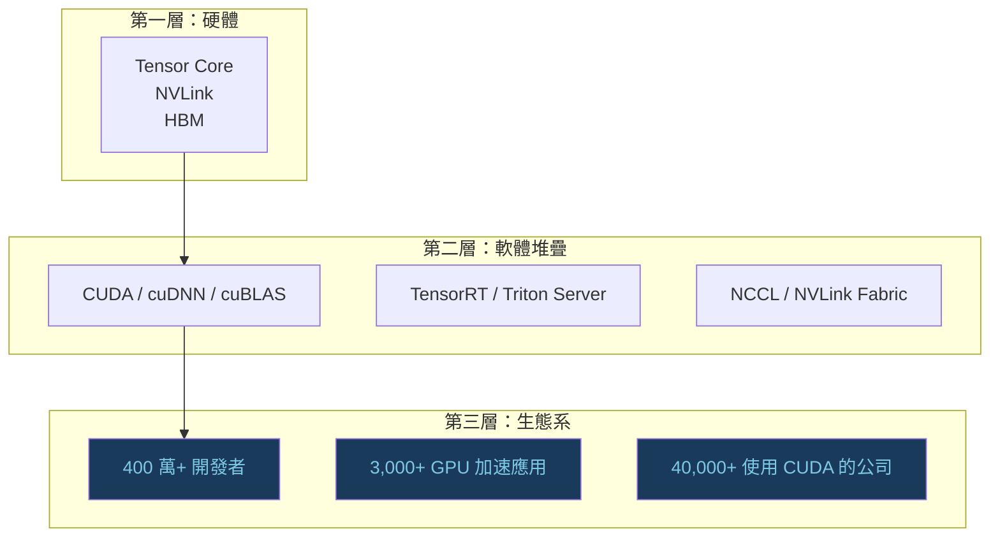
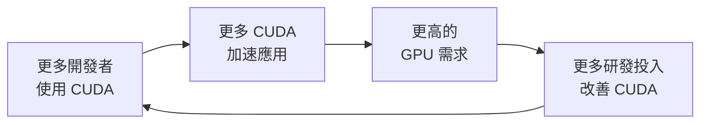

# NVIDIA 生態系護城河

NVIDIA 在 AI GPU 市場的主導地位，常被誤解為單純的硬體優勢。事實上，**護城河的核心是軟體生態系**，而不是晶片本身。

## 護城河的三個層次

## 為什麼生態系才是護城河

**切換成本極高**。一個深度依賴 CUDA 的 PyTorch 模型，要移植到 ROCm 需要：

1. 確認所有第三方庫都有 ROCm 版本
2. 重新測試效能（ROCm 的 Kernel 實作可能有差異）
3. 調整超參數（因為實際計算結果可能有微小差異）
4. 重新訓練驗證模型品質

大型機構的遷移成本可能高達數個月的工程人力。

## CUDA 生態的關鍵函式庫

| 函式庫 | 用途 | AMD 對應 | 成熟度差距 |
|-------|------|---------|---------|
| cuBLAS | 矩陣乘法 | hipBLAS | 中等 |
| cuDNN | 深度學習算子 | MIOpen | 顯著 |
| NCCL | 多 GPU 通訊 | RCCL | 顯著 |
| TensorRT | 推論最佳化 | ROCm MIGraphX | 顯著 |
| Triton | 自訂 Kernel | 部分支援 ROCm | 進行中 |

## NVIDIA 的飛輪效應

這個飛輪從 2006 年就開始轉動，累積了將近 20 年的慣性。

## 護城河的弱點

NVIDIA 的生態護城河並非無懈可擊：

- **OpenAI Triton**：允許用 Python 寫出接近 CUDA 效率的 GPU 程式，降低遷移摩擦
- **JAX / XLA**：透過編譯器抽象層，降低對 CUDA 直接依賴
- **AMD ROCm 7.0**：主要框架（PyTorch、JAX）的 ROCm 後端逐漸成熟
- **雲端自研**：Google TPU、AWS Trainium 繞過 CUDA，用自有堆疊鎖定客戶

## 延伸閱讀

- [AMD ROCm 7.0 的挑戰](amd-rocm.md) — ROCm 的現況與差距
- [軟體生態決定勝負](software-ecosystem.md) — 完整的軟體層比較
