# 軟體生態決定勝負

GPU 的競爭最終在軟體層決出勝負。本頁完整比較各廠商的軟體堆疊成熟度。

## 完整軟體堆疊對比

```mermaid
flowchart TB
    subgraph "NVIDIA CUDA 堆疊"
        N1["應用層：PyTorch / JAX / TensorFlow"]
        N2["框架橋接：CUDA 後端"]
        N3["加速函式庫：cuDNN / cuBLAS / NCCL"]
        N4["編譯器：NVCC / PTX"]
        N5["驅動層：CUDA Driver"]
        N1 --> N2 --> N3 --> N4 --> N5
    end
    subgraph "AMD ROCm 堆疊"
        A1["應用層：PyTorch / JAX（部分）"]
        A2["框架橋接：ROCm 後端（HIP）"]
        A3["加速函式庫：MIOpen / hipBLAS / RCCL"]
        A4["編譯器：hipcc / AMDGPU LLVM"]
        A5["驅動層：ROCm Driver"]
        A1 --> A2 --> A3 --> A4 --> A5
    end
```

## 關鍵差異：為何軟體差距持續存在

**歷史積累的 Kernel 最佳化**

NVIDIA 的 cuDNN 針對每一代 GPU 架構、每一種常見算子，都進行了手工最佳化（Kernel Autotuning + Hand-tuned）。這需要龐大的工程投入和多年的累積，AMD 的開源策略無法快速複製。

**第三方庫的依賴鏈**

許多高效推論工具（Faster Transformer、FlashAttention、vLLM CUDA kernels）最初只有 CUDA 版本。雖然 ROCm port 逐漸出現，但往往落後數個版本，且效能未必達到 CUDA 水準。

**企業採購的保守性**

企業 ML 團隊選 GPU 時，軟體支援是第一考量：

- 若出了問題，CUDA 的 Stack Overflow 答案遠多於 ROCm
- 框架的 ROCm 路徑維護者較少，Bug 修復較慢
- 招聘 ROCm 工程師比 CUDA 工程師困難

## 打破 CUDA 壟斷的路徑

| 策略 | 代表 | 進展 |
|------|------|------|
| HIP（CUDA 轉譯層） | AMD | 降低移植摩擦，但非零成本 |
| OpenAI Triton | 開源 | 讓 Kernel 開發與硬體解耦 |
| JAX / XLA | Google | 後端抽象，可切換 GPU / TPU |
| 自研雲端晶片 | AWS / 微軟 / Meta | 直接繞過 CUDA 生態 |

## 延伸閱讀

- [NVIDIA 生態系護城河](nvidia-moat.md) — 護城河的層次分析
- [自研晶片：AWS、微軟、Meta](../ai-accelerators/custom-silicon.md) — 最激進的脫離 CUDA 路徑
