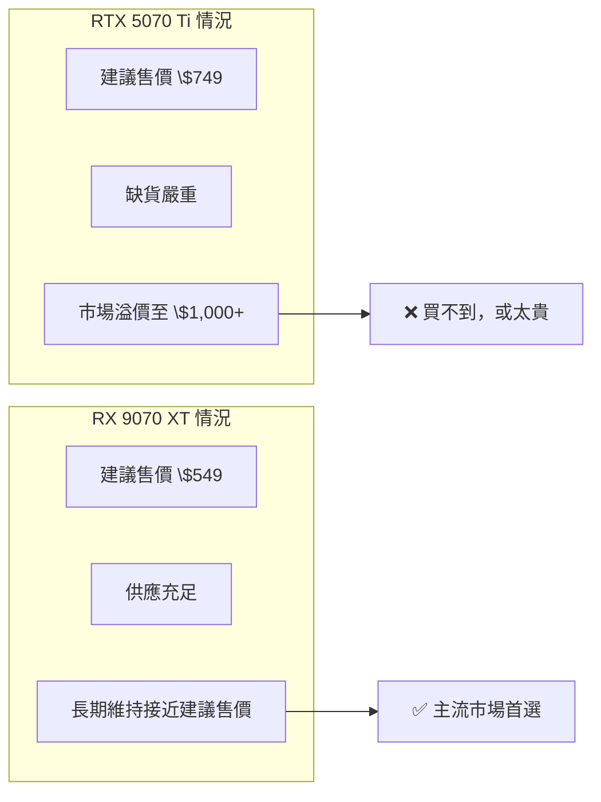

# AMD RX 9070 XT 的市場突破

RX 9070 XT 是 AMD 在 2025 年最重要的消費級產品，不只是技術上的成功，更是市場佔有率的分水嶺。

## 核心規格

| 規格 | RX 9070 XT | RTX 5070 | RTX 4080 Super |
|------|-----------|---------|---------------|
| 架構 | RDNA 4 | Blackwell | Ada Lovelace |
| 計算單元 | 64 CU | — | 80 SM |
| VRAM | 16 GB GDDR6 | 16 GB GDDR7 | 16 GB GDDR6X |
| 記憶體頻寬 | 640 GB/s | 672 GB/s | 736 GB/s |
| 建議售價 | \$549 | \$549 | \$999 |
| 發布時間 | 2025 Q1 | 2025 Q1 | 2024 |

## 為什麼「市場佔有率突破」

**技術層面**：RX 9070 XT 在 1440p 遊戲效能上達到 RTX 4080 水準（僅次於旗艦 RTX 4090），售價卻只要 \$549，性價比創 AMD 近年新高。

**供應層面**：這才是真正的關鍵。

## RDNA 4 的架構改進

- **光線追蹤效能**：翻倍（RDNA 3 是 AMD 光追最大弱點）
- **AI 加速**：新增 AI Accelerator 硬體，提升 FSR 4 效能
- **FSR 4**：AMD 的超採樣技術，RDNA 4 首次支援神經網路版本（類似 DLSS）
- **功耗**：TDP 降至 265W（RDNA 3 旗艦高達 330W）

## FSR 4 vs DLSS 4 的差距

| 技術 | 供應商 | 硬體需求 | 圖像品質 |
|------|-------|---------|---------|
| DLSS 4 | NVIDIA | RTX 20+ | 業界最佳 |
| FSR 4 | AMD | RX 9070+ | 顯著提升，接近 DLSS |
| FSR 3 | AMD | 任何 GPU | 中等 |
| XeSS | Intel | Arc 以上最佳 | 中等 |

## 市場意義

這是繼 2019 年 AMD 推出 RX 5700 XT 以來，AMD 消費級 GPU 最強勢的一次回歸。分析師預測 AMD 消費級市場份額可望從 12% 提升至 18–20%。

## 延伸閱讀

- [消費級市場格局轉變](market-shift.md) — 整體競爭格局
- [GeForce 系列現況](geforce.md) — NVIDIA 的應對策略
