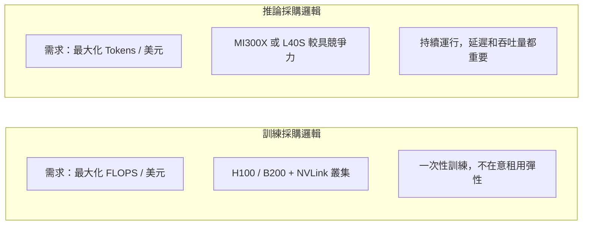

# 性價比分析

硬體規格只是一半，**總體擁有成本（TCO）** 才是企業採購的決策依據。

## 雲端租用成本對比（2024–2025，每小時）

| GPU | 雲端供應商 | 單卡/小時 | 8 卡/小時 | 適合場景 |
|-----|---------|---------|---------|---------|
| H100 SXM 80GB | AWS p4de / Lambda | ~$3.0 | ~$24 | 大規模訓練 |
| H100 PCIe 80GB | CoreWeave | ~$2.2 | — | 中型推論 |
| A100 80GB | AWS p4d | ~$1.9 | ~$15 | 舊世代訓練 |
| MI300X | AMD Cloud | ~$2.5 | ~$20 | 推論 / 大模型 |
| L40S | Lambda | ~$1.3 | — | 推論優先 |

> 注意：雲端定價隨供需波動，以上僅供量級參考。

## 訓練 vs 推論的 TCO 邏輯

## 自建 vs 雲端

| 考量 | 自建優勢 | 雲端優勢 |
|------|---------|---------|
| 長期成本 | 3 年後回本 | 無前期投入 |
| 彈性 | 固定規模 | 快速擴縮 |
| 風險 | 硬體過時 | 定價波動 |
| 維運 | 需要團隊 | 交給供應商 |

## B200 的成本壓力

B200 單卡售價預估 \$30,000–\$40,000（對比 H100 的 \$25,000–\$30,000）。但 B200 推論效能是 H100 的 5 倍，若工作負載是推論，**每 Token 成本可能更低**。

關鍵取捨：前期資本支出 vs 長期運算成本。

## 延伸閱讀

- [訓練效能基準](training-benchmarks.md) — 效能數字的詳細來源
- [加速器取捨總覽](../ai-accelerators/tradeoffs.md) — 各加速器的完整比較
