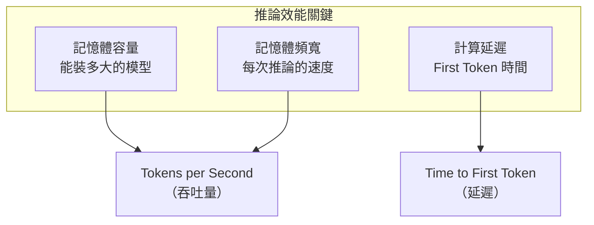

# 推論效能基準

推論和訓練的瓶頸截然不同：訓練是 Compute Bound，推論（小 Batch）是 **Memory Bound**。這個差異使 AMD MI300X 在推論場景具備競爭力。

## 推論效能的決定因素

## 大模型推論：記憶體容量為王

以 LLaMA-3 70B（FP16）為例：

- 模型權重：約 140 GB
- H100（80 GB）：**無法單卡裝載**，需 2 卡
- MI300X（192 GB）：**單卡可裝載**，省去 GPU 間通訊開銷
- B200（192 GB）：單卡可裝載，且計算速度更快

| GPU | 容量 | LLaMA-3 70B 部署 | 優勢 |
|-----|------|-----------------|------|
| H100 80GB | 80 GB | 需 2 卡 | 成熟生態 |
| H200 141GB | 141 GB | 需 2 卡 | 頻寬提升 |
| MI300X | 192 GB | 單卡 | 成本效益高 |
| B200 | 192 GB | 單卡 | 計算 + 容量 |

## Tokens per Second 實測（LLaMA-3 70B, vLLM）

根據 Anyscale / Together AI 的公開測試（2024）：

- **MI300X**：~2,800 tok/s（Batch 64，FP8）
- **H100**：~2,100 tok/s（Batch 64，FP8）
- 差距來自 MI300X 更高的記憶體頻寬（5.3 TB/s vs 3.35 TB/s）

> 推論場景的競爭比訓練更接近，MI300X 在部分配置下**優於** H100。

## 量化對效能的影響

| 精度 | 模型大小 | 速度提升 | 品質損失 |
|------|---------|---------|---------|
| FP16 | 基準 | 1× | 無 |
| BF16 | 基準 | 1× | 極小 |
| INT8 | 50% | ~1.5× | 可接受 |
| FP8 | 50% | ~2× | 極小 |
| INT4（GPTQ） | 25% | ~3× | 依模型而定 |

## 延伸閱讀

- [AMD MI300X 推論優勢](../ai-accelerators/mi300x.md) — 詳細的推論場景分析
- [記憶體層次結構](../architecture/memory-hierarchy.md) — 為何記憶體容量影響推論架構
