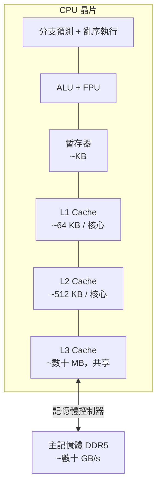
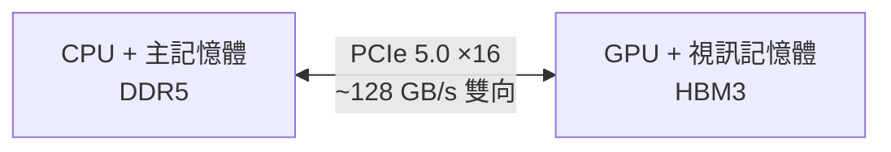

# 計算機組織基礎

要理解 GPU 為何如此設計，必須先理解傳統 CPU 系統的架構。

## 馮紐曼架構

現代電腦以**馮紐曼架構（Von Neumann Architecture）**為基礎：程式指令與資料都存放在同一塊記憶體中，CPU 依序抓取（Fetch）、解碼（Decode）、執行（Execute）。

## CPU 內部結構

| 元件 | 功能 |
|------|------|
| **ALU** | 算術邏輯單元，執行加減乘除與邏輯運算 |
| **控制單元（CU）** | 解碼指令、協調各元件 |
| **暫存器（Register）** | 最快的儲存空間，容量極小（幾 KB） |
| **L1 / L2 / L3 快取** | 位於 CPU 內部，比 RAM 快但容量小 |
| **分支預測器** | 猜測下一條要執行的指令，減少等待 |

## 記憶體層次的速度差異

這是理解 GPU 最關鍵的直覺：**距離運算單元越遠，速度越慢、容量越大、成本越低**。

| 層次 | 典型延遲 | 典型容量 |
|------|---------|---------|
| 暫存器 | < 1 ns | 幾 KB |
| L1 Cache | ~1 ns | 32–64 KB |
| L2 Cache | ~5 ns | 256 KB–1 MB |
| L3 Cache | ~10–30 ns | 8–64 MB |
| 主記憶體（DDR） | ~60–100 ns | 16–512 GB |
| NVMe SSD | ~100 µs | 1–8 TB |

> **關鍵洞察**：CPU 花大量面積在快取和控制邏輯上，目的是讓**少數執行緒**跑得盡可能快（低延遲）。GPU 反其道而行——犧牲單執行緒速度，換取能同時跑**數萬個執行緒**的吞吐量。

## PCIe：CPU 與 GPU 的橋樑

CPU 和 GPU 透過 **PCIe（Peripheral Component Interconnect Express）** 匯流排相連。

PCIe 頻寬在訓練大模型時常成為瓶頸，這也是 NVLink 出現的原因——直接讓多顆 GPU 彼此高速互連，繞過 PCIe 限制（詳見 [B200 與 NVLink](../ai-accelerators/b200.md)）。

## 延伸閱讀

- [執行緒與平行概念](parallel-concepts.md) — 理解 CPU 如何執行多工，再看 GPU 的 SIMT 才有對比
- [GPU 基礎架構](../architecture/gpu-fundamentals.md) — GPU 如何重新設計這套架構
