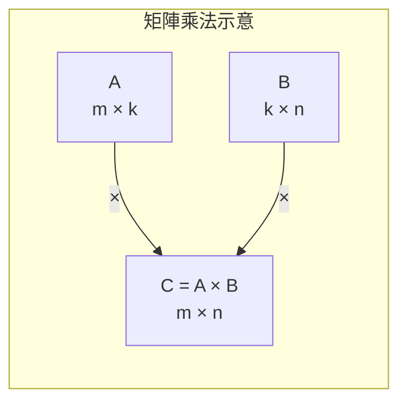
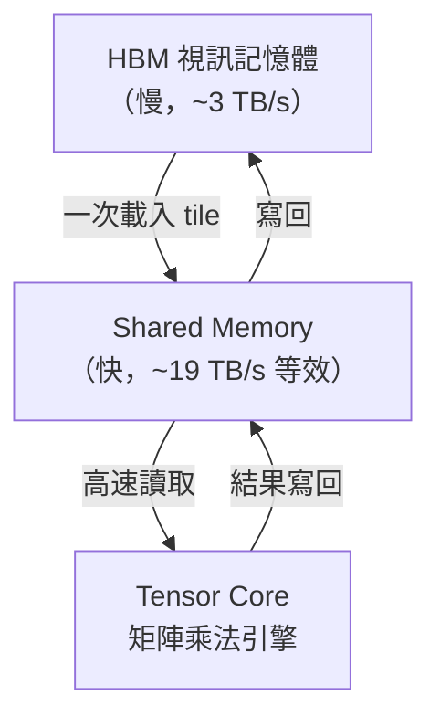

# 矩陣運算基礎

GPU 的設計哲學幾乎就是圍繞著「快速做矩陣乘法」展開的。深度學習的前向傳播、反向傳播，本質上都是大量的**矩陣乘法（GEMM）**。

## 向量與矩陣

**向量（Vector）**：一維的數字陣列，可以表示特徵、embedding、或一筆資料。

```
v = [1.0, 2.5, -0.3, 4.2]   ← 4 維向量
```

**矩陣（Matrix）**：二維的數字陣列，用 `m × n` 表示（m 列、n 行）。

```
A = [[1, 2, 3],
     [4, 5, 6]]    ← 2×3 矩陣
```

## 矩陣乘法（GEMM）

General Matrix Multiplication（GEMM）是 GPU 最核心的運算：

- 若 A 是 `m × k`，B 是 `k × n`，則 C = A × B 是 `m × n`。
- C 的每個元素 `C[i][j]` = A 的第 i 列與 B 的第 j 行的**點積（dot product）**。



計算量為 `O(m × k × n)`，當 m、k、n 都是幾千時，運算量高達數十億次——這正是 GPU 的主場。

## 點積（Dot Product）

點積是 GEMM 的基本構件：

```
a · b = a[0]×b[0] + a[1]×b[1] + ... + a[n-1]×b[n-1]
```

**在神經網路中**，全連接層（Linear Layer）的核心運算就是點積：

```
output = weight_matrix × input_vector + bias
```

## 為什麼 GPU 擅長 GEMM？

GEMM 的計算有極高的**資料重用性（Data Reuse）**：

- 矩陣 A 的每一列會被重複使用 n 次（對應 B 的 n 行）。
- 矩陣 B 的每一行會被重複使用 m 次。

GPU 透過 **Shared Memory** 把需要重複使用的資料存在 SM 內部，避免反覆讀取慢速的 HBM，大幅提升效率（詳見[記憶體層次結構](../architecture/memory-hierarchy.md)）。



## Tensor（張量）

深度學習中常見的是更高維度的**張量（Tensor）**：

| 維度 | 名稱 | 例子 |
|------|------|------|
| 0 維 | 純量 Scalar | 損失值 `3.14` |
| 1 維 | 向量 Vector | Embedding `[0.1, 0.9, ...]` |
| 2 維 | 矩陣 Matrix | 權重矩陣 `W[512][768]` |
| 3 維 | 張量 Tensor | 一批文字 Token `[batch, seq, hidden]` |
| 4 維 | 張量 Tensor | 一批影像 `[batch, C, H, W]` |

高維度的張量操作，最終都會被分解為一系列的 GEMM，這也是為什麼 GPU 的 **Tensor Core** 直接在硬體層加速矩陣乘法，而非通用的加法/乘法。

## 數值精度

GPU 支援多種浮點格式，精度越低，速度越快：

| 格式 | 位元數 | 用途 |
|------|--------|------|
| FP64 | 64 | 科學計算 |
| FP32 | 32 | 訓練基準 |
| BF16 | 16 | 訓練（動態範圍大） |
| FP16 | 16 | 訓練 + 推論 |
| FP8 | 8 | Hopper/Blackwell 訓練加速 |
| INT8 | 8 | 推論量化 |
| FP4 | 4 | Blackwell 推論極致加速 |

> H100 的 Tensor Core 在 FP8 模式下峰值運算量可達 **3,958 TFLOPS**，是 FP32 的約 30 倍，這就是選擇較低精度的回報。

## 延伸閱讀

- [GPU 基礎架構](../architecture/gpu-fundamentals.md) — Tensor Core 如何在硬體層加速 GEMM
- [CUDA 程式設計模型](../architecture/cuda-model.md) — 如何在程式碼層控制這些運算
