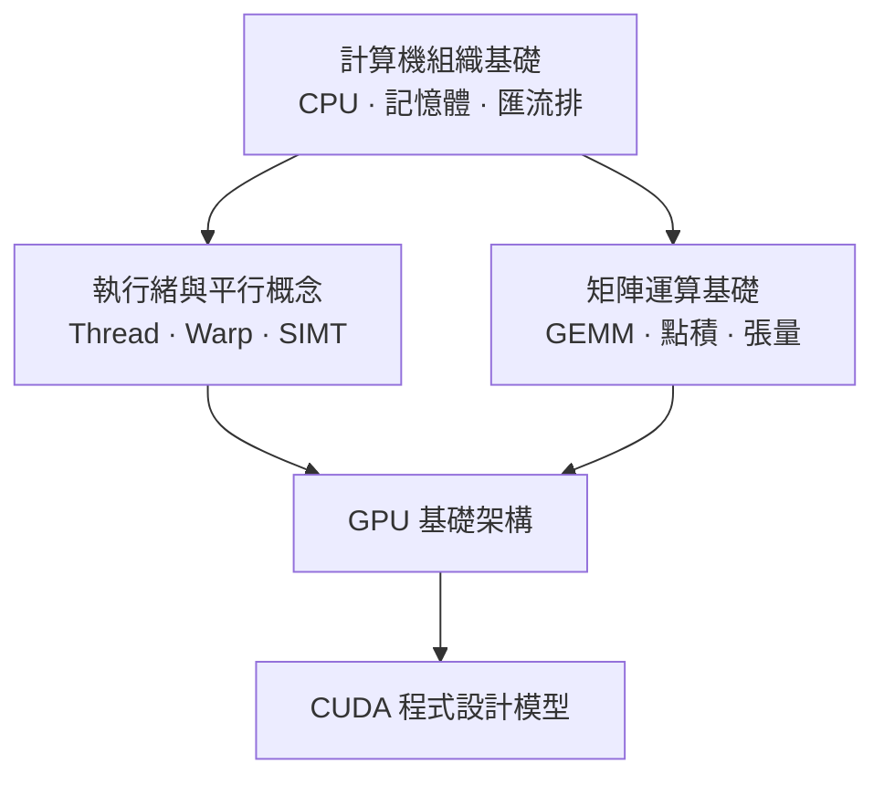

# 前提知識導讀

在進入 GPU 架構之前，本章建立三個必要的基礎概念。如果你已熟悉以下主題，可直接跳到[架構原理](../architecture/gpu-fundamentals.md)。

## 你需要的背景

| 主題 | 核心問題 | 頁面 |
|------|---------|------|
| 計算機組織基礎 | CPU、記憶體、匯流排如何協同運作？ | [計算機組織基礎](computer-basics.md) |
| 執行緒與平行概念 | Process、Thread、並行與平行有何差異？ | [執行緒與平行概念](parallel-concepts.md) |
| 矩陣運算基礎 | 為什麼 GPU 特別適合矩陣乘法？ | [矩陣運算基礎](matrix-math.md) |

## 概念相依關係

## 閱讀建議

- **完全新手**：依序讀完本章三頁，再進入架構原理。
- **有程式背景但不熟硬體**：先讀[計算機組織基礎](computer-basics.md)。
- **熟悉 CPU 但不熟平行計算**：先讀[執行緒與平行概念](parallel-concepts.md)。
- **已有 AI/ML 背景**：可直接跳到[架構原理](../architecture/gpu-fundamentals.md)，前提知識作為參考。
