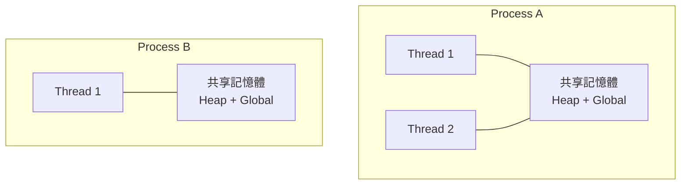
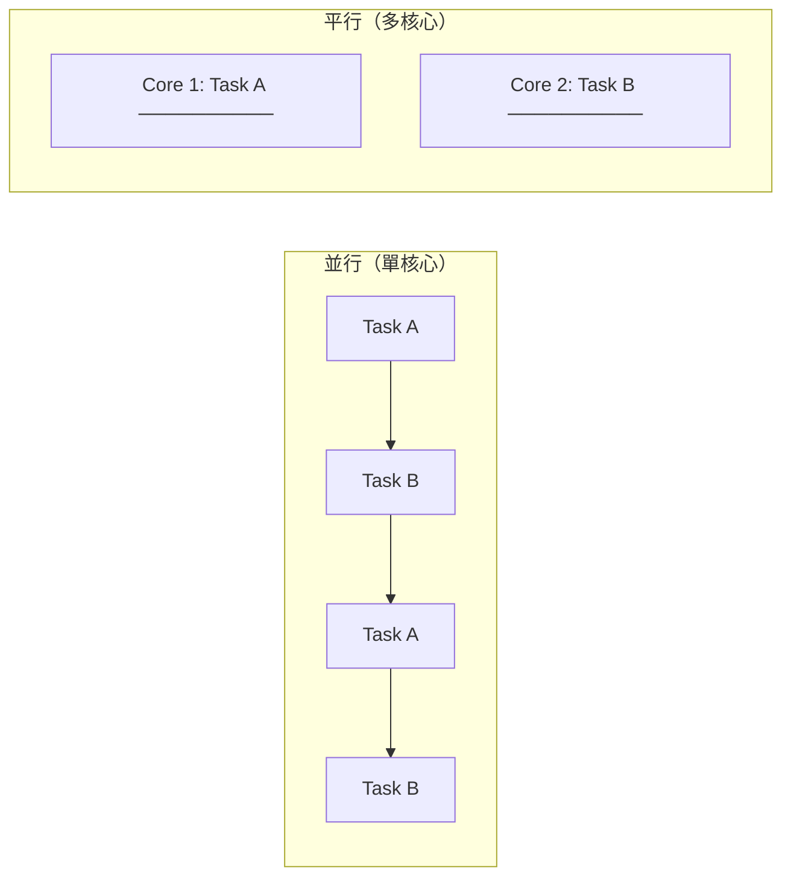
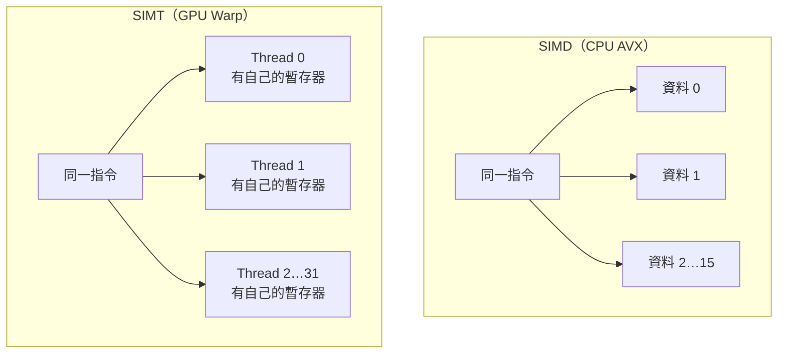
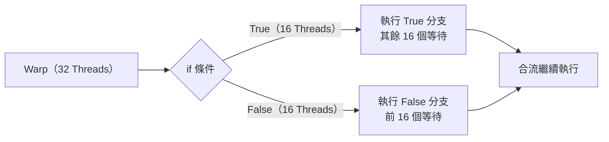

# 執行緒與平行概念

GPU 的核心優勢是**大規模平行執行**。要真正理解這一點，必須先搞清楚「Process」「Thread」「並行」「平行」這幾個常被混用的概念。

## Process vs Thread

| | Process（行程） | Thread（執行緒） |
|---|---|---|
| 定義 | 作業系統分配資源的最小單位 | CPU 排程執行的最小單位 |
| 記憶體 | 獨立的位址空間 | 共享所屬 Process 的記憶體 |
| 切換成本 | 高（需切換位址空間） | 低（共享記憶體） |
| 建立成本 | 高 | 低 |

## 並行 vs 平行

這兩個詞在中文常被混用，但含義不同：

| | 並行（Concurrency） | 平行（Parallelism） |
|---|---|---|
| 本質 | 同時**處理**多件事（輪流切換） | 同時**執行**多件事（真正同步） |
| 硬體需求 | 單核心即可（靠 OS 排程） | 需要多核心 / 多處理器 |
| 比喻 | 一個廚師同時準備 3 道菜（輪流） | 3 個廚師各準備 1 道菜 |

> **GPU 做的是真正的平行**：一張 H100 有 **132 個 SM**，每個 SM 可同時執行多個 Warp，全卡同時執行的執行緒數可達數萬至數十萬。

## SIMD vs SIMT

理解 GPU 執行模型前，需先知道 **SIMD（Single Instruction, Multiple Data）**：

- CPU 的 AVX-512 指令：一次對 16 個 float32 做同一種運算。
- 優點：極高吞吐量；缺點：不同資料必須做完全相同的運算（遇到 `if/else` 會很麻煩）。

GPU 用的是 **SIMT（Single Instruction, Multiple Threads）**，是 SIMD 的擴展：

SIMT 的關鍵差異：每個 Thread 有**自己的暫存器和程式計數器**，可以走不同的分支——但走不同分支的執行緒會被**序列化**（稱為 Warp Divergence），這是 GPU 效能調優的重要課題。

## Warp：GPU 的基本排程單位

NVIDIA GPU 以 **Warp（32 個 Thread）** 為最小排程單位：

- 同一個 Warp 的 32 個 Thread 永遠執行同一條指令。
- 若 Thread 進入不同的 `if` 分支，GPU 會先讓一組執行、另一組等待，再反過來——稱為 **Warp Divergence**，應盡量避免。

## 延伸閱讀

- [矩陣運算基礎](matrix-math.md) — GPU 平行執行最擅長的計算類型
- [CUDA 程式設計模型](../architecture/cuda-model.md) — Thread / Block / Grid 如何對應到硬體
