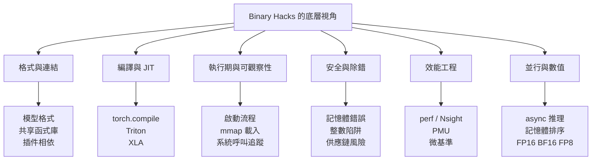

# 全書地圖：從 Binary Hacks 到 AI 工程

如果要把 Binary Hacks 的精神濃縮成一句話，那就是：**抽象化能讓你快速前進，但真正的瓶頸、錯誤與風險，通常都藏在抽象層以下。**

這句話放到 AI 時代比 2006 年更成立。今天的工程堆疊更厚，框架更強，但失敗模式也更多：模型權重無法載入、CUDA 外掛 ABI 不合、`torch.compile()` 產生的 kernel 表現異常、混合精度訓練出現 NaN、服務在高併發下發生記憶體成長。這些問題沒有一個能只靠 API 文件解決。

## 這本 mdBook 的重組邏輯

## 原書七大主題，如何映射到今天的 AI 工作

| 原書主題群 | 今天的 AI 場景 | 這本 mdBook 的位置 |
| --- | --- | --- |
| 二進位與工具入門 | 看懂模型檔、檢查共享函式庫、做最小化觀測 | [二進位思維與可觀察性](01-binary-observability.md) |
| 目標檔與 ELF | 排查 `libtorch.so`、`libcuda.so`、插件依賴與符號衝突 | [格式、連結與符號](02-binary-format-linking.md) |
| GNU 程式設計與 JIT | 理解 compiler pass、kernel codegen、圖編譯器 | [JIT、編譯器與 Kernel 生成](03-codegen-jit.md) |
| 安全程式設計 | 防止記憶體破壞、整數溢位、推理服務供應鏈風險 | [記憶體安全、整數陷阱與除錯工具](05-memory-safety-debugging.md) |
| 執行期 Hack | 啟動流程、`LD_PRELOAD`、`dlopen`、`mmap`、追蹤 | [程式啟動、動態載入與攔截](04-runtime-loading.md) |
| Profiling 與除錯 | CPU/GPU 時間線、硬體計數器、微基準陷阱 | [Profiling、硬體計數器與效能工程](06-profiling-performance.md) |
| 並行、浮點與細節 | lock-free、async、混合精度、量化與數值穩定性 | [並行、記憶體排序與協程](07-concurrency-memory-model.md)、[浮點數、量化與 AI 數值穩定性](08-floating-point-ai.md) |

## 先抓主線，再看細節

如果你只想先建立全局理解，可以先記住下面五條主線：

1. **格式決定可觀察性**：你看不懂檔案與符號，就很難定位部署問題。
2. **編譯器不是黑盒**：AI 框架愈自動化，愈需要理解 codegen 與 JIT。
3. **執行期決定實際成本**：冷啟動、載入、追蹤、mmap、外掛機制都在 runtime 發生。
4. **量測先於優化**：profiling 不是附加工作，而是效能工程的入口。
5. **數值與同步是底線**：再好的模型，如果同步錯誤或數值不穩，結果一樣不可信。

## 這套結構適合怎麼擴充

- 若你之後想補更多原書細節，可以把每一頁拆成更小的子頁。
- 若你想把內容連到實作，可以在每頁底部加上自己的實驗紀錄或命令範例。
- 若你只想保留與 AI 直接相關的內容，這份結構已足夠作為主幹。

> 本頁主題對應 Binary Hacks 全書結構，重點承接第 2 至第 7 章的主要觀念。
