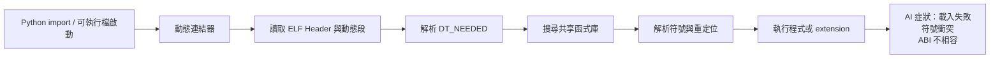

# 格式、連結與符號

AI 部署問題最容易被誤判的地方，就是把「函式庫載入失敗」當成「模型邏輯錯誤」。只要系統裡有 `.so`、C++ extension、GPU runtime 或 plugin，格式、連結與符號就一定是第一級公民。

## 為什麼 ELF 與連結觀念仍然重要

在 Linux 世界，很多 AI 工具鏈最後都會落成 ELF 或依附於 ELF：

- `libtorch.so`
- `libcuda.so`
- `libcudnn.so`
- Triton / TensorRT / ONNX Runtime 的外掛
- 你自己編譯的 Python extension

這表示你至少需要懂三件事：

1. **格式**：檔案裡有哪些 section、segment、動態資訊。
2. **連結**：哪些依賴在建置期決定，哪些在執行期解析。
3. **符號**：名稱最後怎麼對到真正的位址與實作。

## section 與 segment：靜態世界與執行世界

- **section** 偏向給編譯器、連結器與分析工具看。
- **segment** 偏向給 loader 與執行期看。

這個區分很重要，因為很多問題在 build-time 看起來合理，到了 runtime 卻完全不同。例如你在目標檔裡看得到某個 section，不代表它會以你想像的方式映射進進程位址空間。

## 動態連結到底在做什麼

對 AI 工程師來說，這張圖最重要的訊息是：`import` 不是語言層小事，而是一條完整的 runtime pipeline。

## 常見失敗模式

### 1. 找不到函式庫

典型症狀：

- `cannot open shared object file`
- `DLL load failed` 的 Linux 版本
- 容器裡明明有檔案，但 runtime 還是找不到

這時候要查的是搜尋路徑、RPATH、RUNPATH、容器內部 layout，而不是模型本身。

### 2. 找得到檔案，但符號解析失敗

典型症狀：

- `undefined symbol`
- C++ extension 可載入，但呼叫時崩潰
- 升級 PyTorch 或 CUDA 後才出問題

這通常和 ABI、name mangling、符號版本或編譯選項有關。Binary Hacks 讓人最受用的一點，就是它把這些問題視為「可解析的結構」，而不是神祕黑魔法。

### 3. 可執行，但成本異常

有些情況不是載入失敗，而是：

- 啟動時間變長
- 第一次推理特別慢
- 每次熱更新都重新載入大量依賴

這常常跟 lazy binding、plugin 架構、初始化副作用有關。

## AI 場景下特別值得注意的概念

| 概念 | 為什麼重要 | AI 例子 |
| --- | --- | --- |
| ABI | API 沒變，不代表 binary 一定相容 | PyTorch C++ extension 升版後無法載入 |
| Symbol visibility | 不必要的匯出會污染全域符號空間 | 多個 framework 放在同一進程時互撞 |
| PIC / PIE | 影響共享函式庫與安全強化 | Plugin 必須用合適方式編譯 |
| GOT / PLT | 解釋間接呼叫與 lazy binding 成本 | latency-sensitive 路徑可能受影響 |

## 一條務實的排查路線

1. 用 `ldd` 看依賴鏈是否完整。
2. 用 `readelf -d` 看 `DT_NEEDED`、RPATH、RUNPATH。
3. 用 `nm --demangle` 或 `objdump -T` 看符號是否存在。
4. 把錯誤定位到「檔案不存在、符號不存在、版本不合」三者之一。

只要能把問題縮成這三類，處理速度就會快很多。

下一步如果想理解這些依賴為什麼在某個時間點才被拉進來，請接著看[程式啟動、動態載入與攔截](04-runtime-loading.md)。

> 本頁主題對應 Binary Hacks 第 2 章與第 3 章中關於 ELF、binutils、符號與動態連結的核心觀念。
