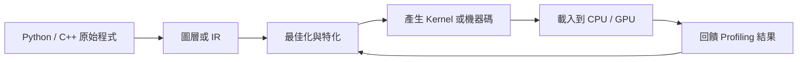

# JIT、編譯器與 Kernel 生成

很多人把 AI 編譯器看成新的專業領域，但如果把名詞先拿掉，核心問題其實很老：**如何把高階描述轉成更接近硬體的執行形式，並在適當時機做特化。** 這正是 Binary Hacks 在 GNU 擴展、內聯組語與 JIT 主題裡早就鋪好的地基。

## 從「寫程式」到「生程式」

今天的 AI 系統很少直接只跑原始碼；更常見的是下面這條鏈：

這條鏈在不同系統裡會有不同名字：

- PyTorch 2.x：`torch.compile()`、AOTAutograd、Inductor
- XLA：graph capture、HLO、lowering
- TVM：Relay、TIR、auto-tuning
- Triton：以 Python-like 語法描述 GPU kernel，再產生低階碼

名字不同，但本質接近：把通用程式轉成更具場景意識的實作。

## 為什麼 Binary Hacks 的舊主題還有用

### GNU 擴展

GNU 擴展提醒你：編譯器不是單純翻譯器，它也提供額外語意，例如 branch hint、alignment、packed layout、內建位元操作。今天寫高效能 kernel 時，這種「告訴編譯器更多事」的能力仍然很關鍵。

### 內聯組語與 intrinsics

不是每個 AI 工程師都要寫組語，但你至少要知道：

- 為什麼 vectorization 能讓吞吐量上升。
- 為什麼 memory layout 會影響 SIMD 利用率。
- 為什麼 GPU kernel 仍然是把高階數學運算拆成極低階指令。

今天多數情況會先用 intrinsics、compiler builtin 或 Triton，而不是直接手寫組語；但背後思路沒有變。

### JIT

JIT 的價值不只是「執行時產生程式碼」，更重要的是**執行時知道更多上下文**，例如：

- 目前的 batch size
- 實際 tensor shape
- 硬體能力與指令集
- 是否值得 fusion

AI 工作負載尤其適合這種特化，因為 shape、dtype、layout 與 target hardware 都會直接影響最佳實作。

## 現代 AI 編譯器，最終仍回到底層

| 現代名詞 | 底層本質 |
| --- | --- |
| graph capture | 先把計算語意抽出來，再決定怎麼落地 |
| lowering | 把高階運算拆成更低階操作 |
| kernel fusion | 減少中間結果搬移與 launch overhead |
| auto-tuning | 用量測取代猜測，找出更好的實作 |
| codegen | 真的產生可被硬體執行的形式 |

這也是為什麼理解編譯器與 runtime interface 很重要：你愈懂底層，就愈不容易把 compiler 行為當成不可解釋的魔法。

## 一個常見誤區

有些人認為「AI 編譯器會幫我做優化，所以我不用管底層」。實際上正好相反：

- 你要知道什麼資訊值得暴露給編譯器。
- 你要知道什麼情況會讓編譯器失去最佳化空間。
- 你要知道 profiling 回來的資料應該回饋到哪一層。

否則你只能在結果不好時重跑幾次，希望運氣變好。

## 實務上的三個判斷題

1. 這個瓶頸是因為演算法、layout，還是 codegen 品質？
2. 這個 JIT 帶來的編譯成本，值不值得換這個 workload 的執行收益？
3. 這個 kernel 問題應該在框架層修，還是該往 IR 與 generated code 看？

如果你能把問題問到這個粒度，Binary Hacks 的編譯器觀念就已經被你帶進 AI 時代了。

可與[Profiling、硬體計數器與效能工程](06-profiling-performance.md)一起閱讀，因為沒有量測，JIT 只剩想像。

> 本頁主題對應 Binary Hacks 第 3 章中 GNU 擴展、內聯組語、JIT 與程式碼生成的相關 Hack。
