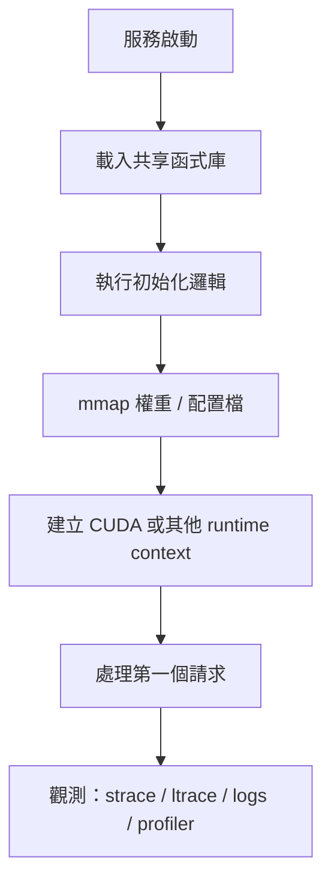

# 程式啟動、動態載入與攔截

AI 服務的很多「第一個請求特別慢」或「明明有檔卻載不進來」問題，其實都發生在真正算模型之前。Binary Hacks 在執行期主題裡最有價值的地方，就是把這些隱形成本攤開。

## 啟動不是一個瞬間，而是一條鏈

這條鏈中的每一步都可能是冷啟動的主要成本來源：

- 動態連結器花時間解析依賴。
- extension 的 constructor 做了額外初始化。
- 權重使用 `read()` 而不是 `mmap`，導致多一次拷貝。
- GPU context 在第一個 request 才建立。

## 為什麼 `mmap` 對 AI 特別重要

大型模型檔往往大到不適合用「一次讀完再複製」的思路。`mmap` 的好處是：

- 把檔案直接映射到位址空間。
- 讓 OS 幫你處理分頁與延遲載入。
- 容易讓多進程共享同一份只讀權重。

這種思想今天出現在很多模型格式與服務策略裡。你不一定天天直接寫 `mmap()`，但你一定會受它影響。

## `dlopen` 與 plugin 思維

AI 框架愈來愈依賴插件化：

- ONNX Runtime 的 Execution Provider
- TensorRT plugin
- Python C extension
- 自訂 allocator、tracer、runtime backend

`dlopen` 的重要性，不只在載入函式庫，而在**讓系統在執行期改變能力組合**。這讓架構更彈性，也讓排錯更難，因為真正被載入的東西可能只在特定條件下出現。

## `LD_PRELOAD`：不是技巧，而是一種觀察與注入方式

`LD_PRELOAD` 的工程價值在於：你可以在不改原始碼的情況下，攔截既有函式。

典型用途包括：

- 追蹤 `malloc` / `free`
- 加入記錄與計時
- 置換 allocator
- 對既有程式做實驗性 instrumentation

這在 AI 服務很有用，因為你常常沒有空或沒有權限重編大型框架，但仍需要知道 runtime 到底做了什麼。

## `strace` 與 `ltrace` 依然值得會

當服務啟動很慢時，最實用的問題不是「哪段 Python 慢」，而是：

- 系統呼叫是不是卡在檔案 I/O？
- 有沒有反覆打開同一批檔案？
- 是 loader 在找函式庫，還是應用程式在做初始化？

`strace` 與 `ltrace` 提供的是「這個程序真的做了什麼」的證據。這種證據對排查容器、driver 與 framework 的交界問題尤其重要。

## AI 場景的三種常見 runtime 問題

1. **冷啟動太慢**：實際成本藏在初始化與載入階段，而非模型計算本身。
2. **熱更新不穩**：plugin、共享函式庫與舊狀態殘留互相作用。
3. **觀測困難**：框架層只報一個錯，但真正行為散落在 loader、I/O、allocator、driver。

## 如何把 runtime 問題切開

- 先區分「載入成本」與「執行成本」。
- 再區分「檔案 I/O」「函式庫初始化」「裝置 context 建立」。
- 最後才進到框架內部邏輯。

這個切法會讓你的冷啟動與插件問題不再像一團霧。

相關問題可與[格式、連結與符號](02-binary-format-linking.md)和[記憶體安全、整數陷阱與除錯工具](05-memory-safety-debugging.md)一起看。

> 本頁主題對應 Binary Hacks 第 5 章中程式啟動、`dlopen`、`LD_PRELOAD`、`mmap`、追蹤與執行期觀測的相關內容。
