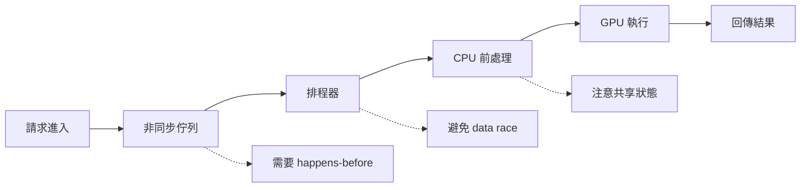

# 並行、記憶體排序與協程

AI 系統的並行問題，表面上常被包成「吞吐量優化」或「async 支援」，但底下其實是兩個完全不同的層次：

1. **工作如何分配與排程**：threads、processes、coroutines、queues。
2. **共享狀態如何保持正確**：memory ordering、鎖、原子操作、同步原語。

Binary Hacks 對這一題的啟發，在 AI 時代反而更重要，因為今天的推理服務、資料管線與 runtime 幾乎都在高併發下運作。

## 一張簡化的 AI 服務並行圖

這張圖提醒你，並行不是只有「多開幾個 worker」，而是每一段都在交換狀態、所有權與時序保證。

## 記憶體排序為什麼不能忽略

很多工程師只有在寫 lock-free 結構時才想到 memory ordering，但其實只要你有：

- ring buffer
- work queue
- producer-consumer
- 多執行緒 cache

你就已經在使用某種記憶體模型。x86、ARM、GPU 各自的排序保證不同，如果你只靠「我在本機跑起來沒事」，那只是剛好沒出錯。

## AI 場景中的典型同步議題

### 請求排程

推理服務常需要把多個請求合併成 batch。這裡會遇到：

- queue 如何避免鎖競爭
- timeout 與吞吐量如何取捨
- 誰擁有 batch 內 tensor 的生命週期

### 非同步資料處理

資料前處理、網路 I/O、快取查詢很適合用 coroutine；但只要你把 coroutine 當成「更便宜的執行緒」，就容易忽略共享狀態與 backpressure。

### GPU 與 CPU 的同步邊界

很多看起來像 GPU 慢的情況，其實是 CPU 在等待同步點，或某段 host 端邏輯把 pipeline 切碎了。

## 協程的價值與限制

協程很適合：

- 大量 I/O 等待
- 高連線數的 inference gateway
- 需要維持高吞吐但單次工作不重的控制平面

協程不會自動解決：

- CPU-bound 熱點
- 真正的共享狀態競爭
- 跨裝置同步成本

所以 Binary Hacks 提醒的「輕量並行」觀念，到了今天應該翻成：**把 coroutine 當成排程工具，而不是正確性保證。**

## 實務上最容易出事的三個點

1. **以為 queue 是 thread-safe，就等於整個流程安全。**
2. **把 `async` 視為效能保證，而不是延遲隱藏手段。**
3. **忽略弱記憶體模型與裝置同步，讓 bug 只在特定機器上重現。**

## 一個好用的思考框架

當你設計並行系統時，至少分開回答：

- 狀態在哪裡共享？
- 誰擁有它？
- 什麼時候可見？
- 哪個同步原語保證這件事？

只要這四個問題還答不清楚，就不應該相信系統在壓力下會維持正確。

下一頁的[浮點數、量化與 AI 數值穩定性](08-floating-point-ai.md)則會補上另一條底線：即使同步沒錯，數值表示不對，結果仍然可能失真。

> 本頁主題對應 Binary Hacks 第 7 章中記憶體排序與協程相關內容，並延伸到現代 AI 服務的排程與同步模型。
