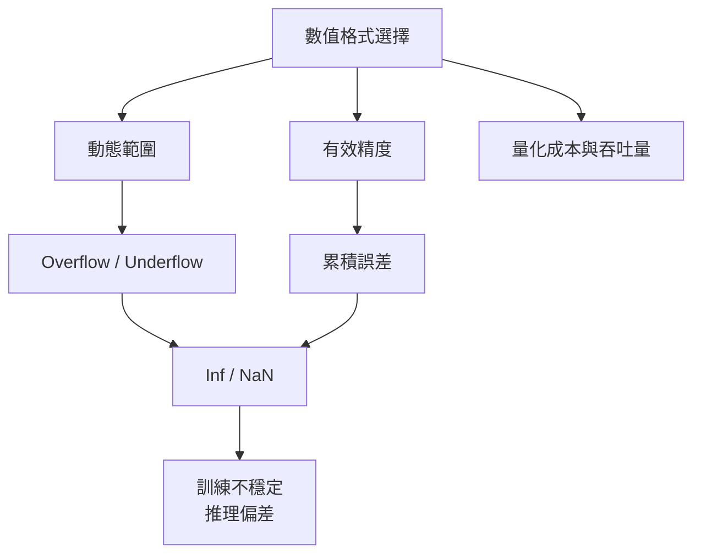

# 浮點數、量化與 AI 數值穩定性

如果只能從 Binary Hacks 帶一個主題進 AI 時代，我會選浮點數。因為今天的 AI 幾乎處處都在用不完整、有限且帶有硬體特性的數值表示：FP32、FP16、BF16、FP8、INT8、INT4。不了解它們，很多訓練與推理現象都只能停留在「玄學」。

## 一張從表示法到失敗模式的圖

這張圖的重點是：數值格式不是儲存細節，而是系統行為的一部分。

## Binary Hacks 的舊問題，今天變成 AI 的日常

原書討論浮點二進位表示、特殊值與邊界行為，在今天對應成：

- 為什麼 mixed precision 可以更快，但更容易數值不穩。
- 為什麼 BF16 常比 FP16 更穩定。
- 為什麼 NaN 一旦出現，會沿著圖快速擴散。
- 為什麼量化不是「壓小一點」這麼簡單，而是重新設計表示法與誤差分配。

## 常見格式的工程意義

| 格式 | 特色 | 常見用途 | 主要風險 |
| --- | --- | --- | --- |
| FP32 | 範圍與精度均衡 | 基準訓練、敏感計算 | 成本較高 |
| FP16 | 吞吐高、儲存小 | 推理、混合精度訓練 | 動態範圍小，易 overflow |
| BF16 | 指數位較多 | 大模型訓練與推理 | 精度較粗，需注意累積誤差 |
| FP8 | 更激進的壓縮 | 新一代加速器上的高吞吐路徑 | 校準與穩定性要求高 |
| INT8 / INT4 | 定點量化 | 邊緣部署、極致壓縮 | 校準錯誤會直接傷害品質 |

## 你真正需要理解的三件事

### 1. 動態範圍

有些格式不是「不準」，而是「裝不下」。這會導致 overflow、underflow、denormal 或大量 clipping。訓練時常表現成 loss 突然爆掉，推理時則可能是極端輸入不穩。

### 2. 精度分配

即使沒有溢位，精度不足也會讓：

- reduction 累積誤差放大
- softmax、layer norm 等敏感算子失真
- 量化後的分布失去可分辨性

### 3. 特殊值傳播

`Inf`、`NaN` 不是罕見事件，而是非常實用的偵錯信號。它們告訴你：

- 某處超出了表示法能力
- 或某個算子已經進入非法數學域

懂得追它們的來源，比只在最後一層看到 `nan` 更重要。

## 量化與浮點不是兩個世界

量化常被當成獨立主題，但它本質上還是在處理兩件事：

1. 如何用更少 bit 表示足夠有用的數值。
2. 如何把誤差控制在任務可以接受的範圍內。

這讓 Binary Hacks 的浮點思維仍然適用：先搞懂 bit-level representation，再談模型品質與部署效率。

## AI 工程上的幾個實用原則

- 先找出對數值最敏感的算子，再決定 dtype 策略。
- 把 NaN/Inf 檢查當成 runtime 訊號，而不是事後補救。
- 不要把量化誤差只看成精度下降，也要看它如何改變系統穩定性與 tail behavior。

## 為什麼這一頁值得最後再重讀一次

很多低階主題會讓系統「跑不起來」，但浮點數會讓系統「跑得動卻不可信」。在 AI 時代，後者往往更危險。

> 本頁主題對應 Binary Hacks 第 7 章中浮點數表示、特殊值與低階數值細節的相關內容，並延伸到 FP16、BF16、FP8 與量化。
