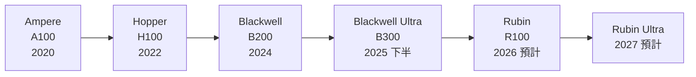
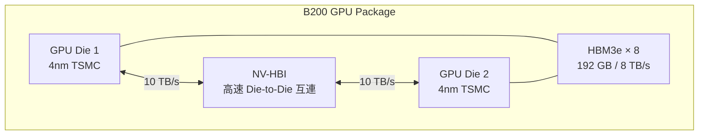
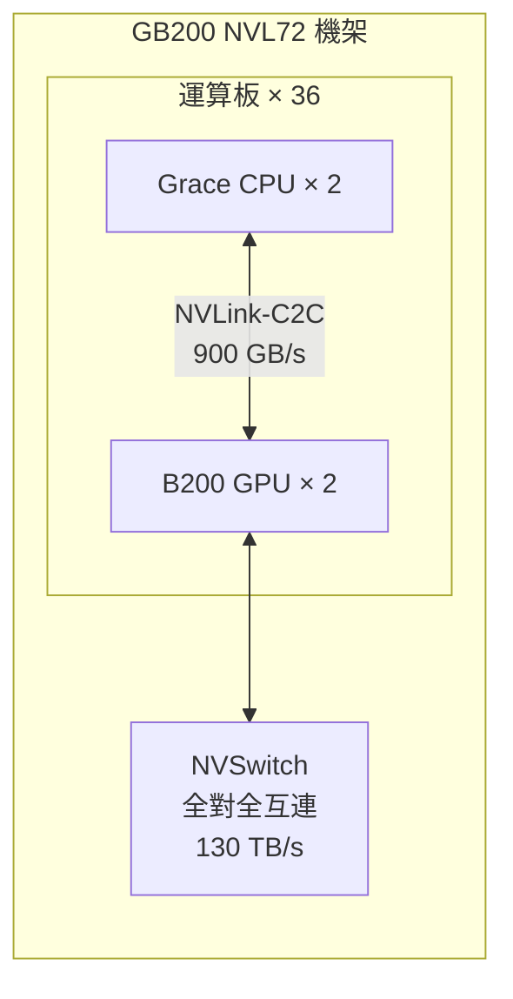

# 架構演進：從 Hopper 到 Blackwell

NVIDIA 每 2 年左右推出一代新的 GPU 微架構。每一代的命名都向偉大科學家致敬：Hopper（電腦先驅 Grace Hopper）、Blackwell（數學家 David Blackwell）、Rubin（天文學家 Vera Rubin）。

## 架構世代時間軸

## Hopper H100（2022–2024 主力）

H100 是 AI 熱潮的硬體代名詞。ChatGPT 爆紅後，全球雲端業者瘋搶 H100，供不應求持續超過 18 個月。

**關鍵規格：**
- 製程：台積電 4N（類 4nm）
- CUDA Cores：16,896
- Tensor Cores：528（第四代）
- HBM3：80 GB，3.35 TB/s
- NVLink 4.0：GPU 間互連

**重要創新：**
- **Transformer Engine**：首次為 Transformer 模型設計的專用加速，自動切換 FP8 / FP16 精度
- **NVSwitch**：讓 8 個 H100 組成 DGX H100，以全對全 900 GB/s 互連

## Blackwell B200（2024–）

Blackwell 最顯著的突破是**雙晶片設計**：兩顆大型 GPU Die 用 NV-HBI（NVIDIA High-Bandwidth Interface）連接，對作業系統和 CUDA 來說仍像一顆單一 GPU。

**關鍵規格（B200 SXM）：**

| 項目 | H100 SXM | B200 SXM |
|------|----------|----------|
| CUDA Cores | 16,896 | 21,760（× 2 Die） |
| HBM 容量 | 80 GB | 192 GB |
| 記憶體頻寬 | 3.35 TB/s | 8 TB/s |
| FP8 算力 | 3,958 TFLOPS | ~9,000 TFLOPS |
| TDP 功耗 | 700 W | 1,000 W |

**FP4 支援**：Blackwell 新增 FP4 精度，在推理（Inference）場景下可達到更高吞吐量。

## GB200 NVL72：AI 工廠規模

GB200 是「Grace CPU + Blackwell GPU」的組合，NVL72 是以 72 顆 B200 GPU + 36 顆 Grace CPU 組成的機架規模超級系統。

## 為什麼每代都有大幅提升？

NVIDIA 的效能提升遠超 Moore's Law，關鍵在於同時推進三個軸：
1. **製程**：更新的 TSMC 節點
2. **架構**：Tensor Core 設計、低精度支援
3. **系統**：NVLink / NVSwitch 互連頻寬

過去十年 AI 訓練效能提升超過 100 萬倍，Moore's Law 只能解釋其中百倍。
