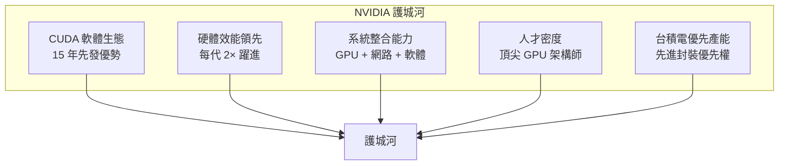
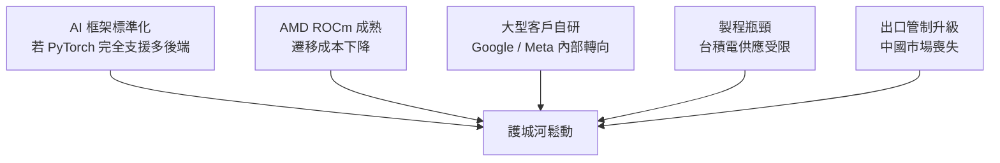

# 市場競爭與護城河

## NVIDIA 的護城河全景

## 主要競爭者分析

### AMD（最直接的硬體競爭者）

AMD 的 MI300X GPU 在規格上具有競爭力（HBM 容量更大），且 ROCm 軟體棧持續改善。但 CUDA 生態的切換成本讓大多數用戶維持 NVIDIA。

| 比較面向 | NVIDIA H100 | AMD MI300X |
|----------|-------------|------------|
| HBM 容量 | 80 GB | 192 GB |
| 峰值算力（FP16） | 1,979 TFLOPS | 1,307 TFLOPS |
| 軟體生態 | CUDA（成熟） | ROCm（追趕中） |
| 市占率 | ~90% | ~5–10% |

### Google（自研 TPU）

Google 的 TPU（Tensor Processing Unit）是目前最成功的 ASIC AI 加速器，Google 內部大量使用。但 TPU 不對外銷售，也不支援 CUDA，因此不直接威脅 NVIDIA 的外部市場。

### AWS Trainium / Inferentia

Amazon 的自研芯片主要為了降低自家雲端成本，對 NVIDIA 的外部銷售影響有限。

### 新創 AI 晶片公司

Groq、Cerebras、SambaNova 等公司針對特定推理場景具有速度優勢，但缺乏完整的軟體生態，難以撼動 NVIDIA 在訓練市場的地位。

## 護城河的脆弱性

護城河不是永恆的。以下情境可能削弱 NVIDIA 的優勢：

## 為什麼 NVIDIA 持續領先？

關鍵在於**正向循環**：

1. 更多開發者使用 CUDA → 更多模型和工具 → 更高的切換成本
2. 更高的毛利率 → 更多 R&D 投入 → 更快的架構迭代
3. 更強的硬體 → 更多大型客戶 → 更多資金回購研究 → 回到第一步

這個飛輪效應在過去十年一直在加速，很難靠單一突破打破。
