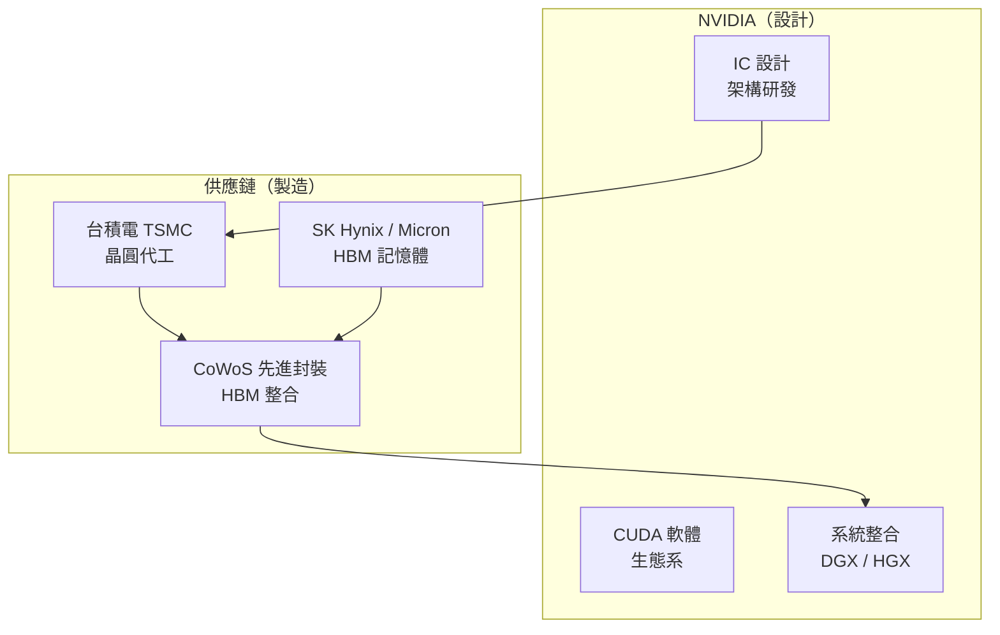
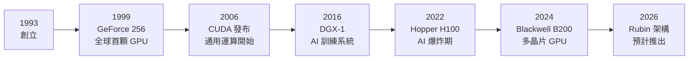

# 公司概覽

NVIDIA 創立於 1993 年，由 Jensen Huang（黃仁勳）、Chris Malachowsky 與 Curtis Priem 共同創辦。最初以遊戲 GPU 起家，30 年後已成為全球 AI 基礎設施最關鍵的供應商。

## 公司定位

NVIDIA 是一家 **Fabless IC 設計公司**——自己設計晶片，但不擁有晶圓廠，全部委外製造。這個商業模式讓它能將資本集中在研發與軟體生態，而非動輒數千億的晶圓廠建置成本。

## 三大業務部門（FY2026）

| 部門 | 年營收 | 年增率 | 說明 |
|------|--------|--------|------|
| 資料中心 | ~$1,937 億美元 | +68% | AI 訓練與推理 GPU、網路 |
| 遊戲 | ~$247 億美元 | — | GeForce RTX 系列 |
| 專業視覺化 | ~$32 億美元 | +70% | Quadro / RTX 工作站 |
| 汽車與機器人 | ~$23 億美元 | +39% | 自駕與具身智慧 |

資料中心已佔總營收約 **90%**，NVIDIA 本質上已從遊戲 GPU 公司轉型為 AI 基礎設施公司。

## 時間軸

## 與台積電的依賴關係

NVIDIA 所有高階 GPU 均由台積電以 4nm / 3nm 等先進製程代工。這種深度依賴既是優勢（專注設計）也是風險（地緣政治、產能分配）。台灣客戶（主要是供應鏈夥伴）佔 NVIDIA FY2026 總營收約 **19.6%**。
