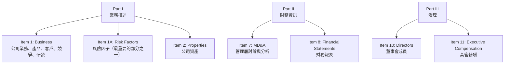

# 如何閱讀 NVIDIA 年報（10-K）

10-K 是美國上市公司每年向 SEC 申報的年度報告，是最完整的第一手資料。可從 [investor.nvidia.com](https://investor.nvidia.com) 或 SEC EDGAR 免費下載。

## 10-K 的基本結構

## 優先閱讀順序（效率最高）

### 第一步：Item 1A — Risk Factors（風險因子）

這是 NVIDIA 自己寫出來他們認為最重要的風險。法律部門撰寫，措辭謹慎，但能幫你快速了解公司面臨什麼樣的挑戰。

**在 NVIDIA 10-K 中特別注意：**
- 出口管制相關風險（近年篇幅大幅增加）
- 客戶集中度風險
- 台積電依賴風險
- 競爭風險

### 第二步：Item 1 — Business（業務描述）

了解 NVIDIA 如何描述自己的業務、產品線、客戶群體與市場定位。注意每年的措辭變化——若某個業務突然被強調或被淡化，往往有意義。

### 第三步：Item 7 — MD&A（管理層討論與分析）

CEO / CFO 對財務結果的解釋。重點看：
- 各業務部門的營收變動及原因
- 毛利率變化的解釋
- 前瞻性展望（通常措辭保守但有方向性）

### 第四步：財務報表本體

| 報表 | 看什麼 |
|------|--------|
| 損益表（Income Statement） | 營收、毛利率、R&D 費用、淨利 |
| 資產負債表（Balance Sheet） | 現金、存貨、負債結構 |
| 現金流量表（Cash Flow Statement） | 自由現金流、資本支出、股票回購 |

## 關鍵財務指標解讀

**存貨（Inventory）**：若存貨大幅上升，可能是需求放緩的先行指標。NVIDIA 在 2022–2023 年曾有一波存貨積壓，之後 AI 需求爆發才消化。

**資本支出（CapEx）**：NVIDIA 是輕資產公司，CapEx 很低（相對於台積電）。若 CapEx 突然上升，可能是進入新業務或增加數據中心投資。

**股票回購（Buybacks）**：NVIDIA 長期積極回購股票，這是股東友好的資本配置訊號，也反映管理層對未來現金流的信心。

## 財報電話會議（Earnings Call）的補充

10-K 是年度文件，季報（10-Q）和季度財報電話會議能提供更即時的資訊。Jensen Huang 在電話會議中常提供有價值的行業觀點。逐字稿可在 Seeking Alpha 或 NVIDIA IR 頁面找到。

## 值得長期追蹤的數字

1. **資料中心季度同比增長率**：反映 AI 投資熱度
2. **毛利率趨勢**：是否維持高水位
3. **各地區營收佔比**：特別是中國的變化
4. **前瞻指引（Guidance）**：管理層對下季的展望，市場反應往往比實際業績更重要
