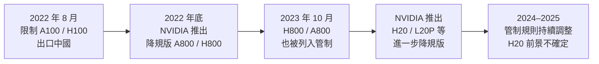
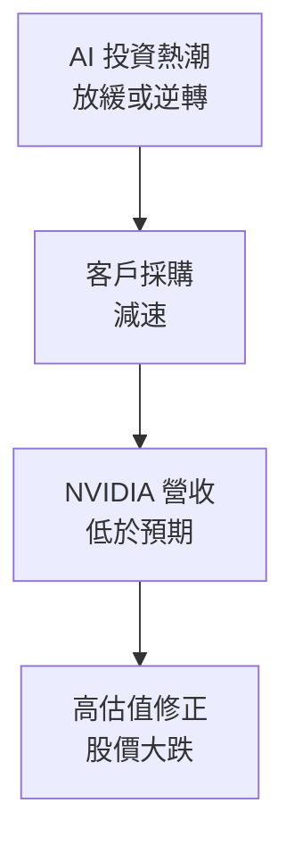

# 風險與出口管制

## 出口管制：NVIDIA 最大的外部風險

美國政府自 2022 年起對高階 GPU 出口中國實施管制，並在 2023、2024 年持續收緊。這是 NVIDIA 最重要的地緣政治風險。

## 管制時間軸

## 對 NVIDIA 的財務衝擊

中國曾是 NVIDIA GPU 的重要市場，但管制後：
- 中國佔 NVIDIA 總營收的比例從約 **20%+ 下滑至個位數**
- 管制不只影響硬體銷售，也阻斷了中國客戶使用最先進 GPU 的路徑

## H20 的灰色地帶

NVIDIA 為中國市場設計的 H20，規格刻意控制在出口管制門檻以下（算力限制、互連限制），但仍提供有用的推理能力。然而美國政府持續評估是否進一步限制，H20 的長期市場地位仍不確定。

## 其他主要風險

### 地緣政治：台灣風險

NVIDIA 幾乎所有先進 GPU 都由台積電製造。台海緊張局勢若升高，對 NVIDIA 供應鏈的衝擊將是災難性的。NVIDIA 目前無可替代的製造夥伴。

### 客戶集中度

前幾大雲端客戶（微軟、Google、Meta、亞馬遜）若決定：
- 大幅擴大自研 ASIC 使用
- 縮減 AI 資本支出
- 轉向競爭對手

任何一個都會對 NVIDIA 營收產生重大影響。

### 估值風險

NVIDIA 的估值反映了極高的成長預期。一旦成長放緩，估值壓縮的幅度可能遠大於一般公司。

### 競爭風險

- AMD 若 ROCm 成熟到足以讓大客戶遷移
- 雲端巨頭若成功將自研 ASIC 擴大到訓練場景（目前主要是推理）
- 中國競爭者（華為昇騰）在受管制市場的替代

## 風險評估框架

| 風險 | 概率 | 衝擊 | 時間框架 |
|------|------|------|----------|
| 出口管制升級 | 中-高 | 高 | 近期 |
| 台灣地緣政治 | 低-中 | 極高 | 中長期 |
| 客戶削減採購 | 中 | 高 | 中期 |
| AMD 競爭升溫 | 中 | 中 | 中長期 |
| AI 泡沫修正 | 中 | 高 | 不確定 |

> 這些風險並不代表 NVIDIA 不值得研究，而是完整理解一家公司需要同時看優勢與風險。
