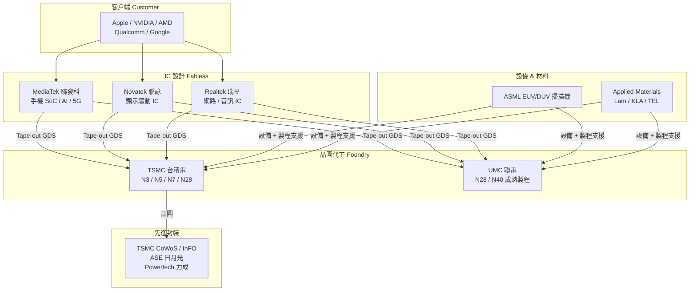
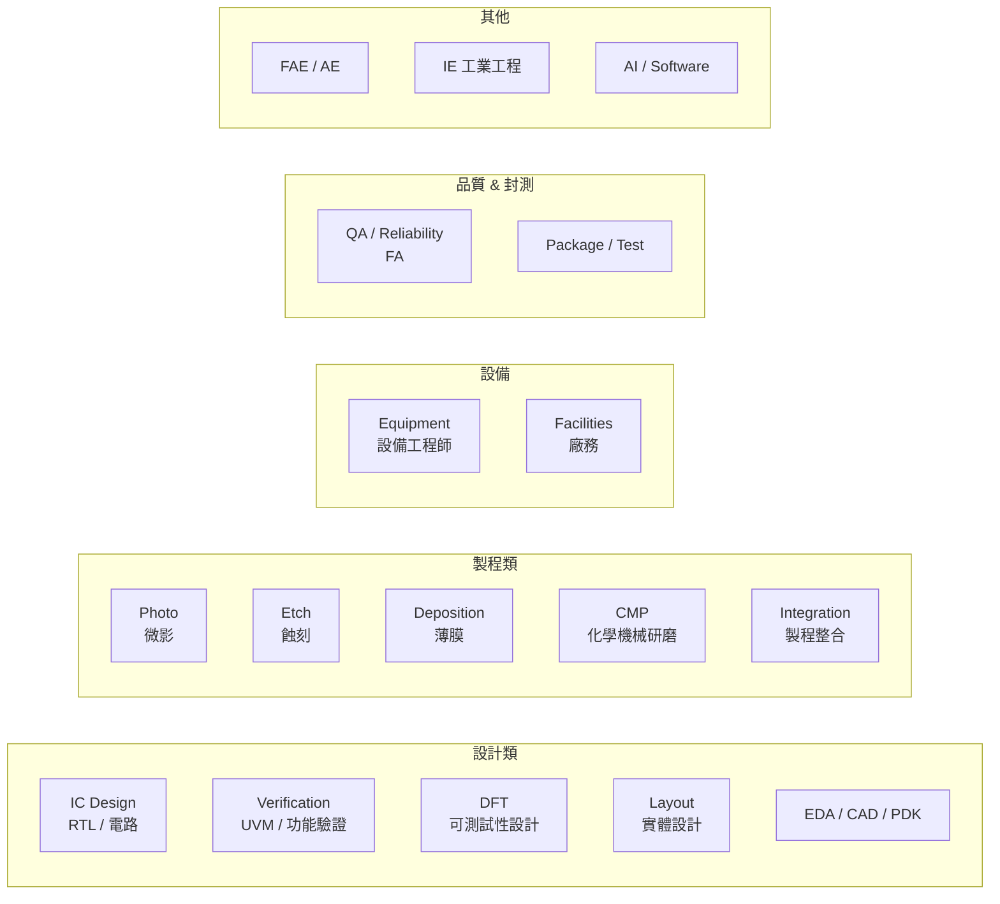

# 產業全貌地圖

## 台灣半導體產業生態系

## 職務分布與人數（估計）

| 環節 | 代表公司 | 主要職務 | 人數規模 |
|------|---------|---------|---------|
| Fabless 設計 | MediaTek、Novatek、Realtek | IC Design、Verification、DFT | ~3–5 萬 |
| 晶圓代工 | TSMC（83,825人）、UMC | Process、Equipment、Integration、Yield | ~10 萬+ |
| OSAT 封測 | ASE（65,695人）、Powertech | Package、Test、QA | ~8 萬+ |
| 設備商 | ASML、AMAT、Lam、KLA | AE、FAE、Field Service | ~1–2 萬 |
| EDA/IP | Synopsys、Cadence、ARM | EDA Engineer、PDK | ~3,000 |

## 職務技能樹

## 薪資排名速覽（2024，年總酬勞 TWD）

| 排名 | 職務 | 新鮮人 | 資深（5–8 年） |
|-----|------|--------|-------------|
| 🥇 | IC Design（NVIDIA/Qualcomm TW） | 180–250萬 | 400–700萬 |
| 🥇 | IC Design（MediaTek） | 140–180萬 | 350–500萬 |
| 🥈 | ASML Application Engineer | 150–250萬 | 300–500萬 |
| 🥈 | EDA/CAD（MediaTek DM） | 120–150萬 | 200–400萬 |
| 🥉 | TSMC 先進封裝工程師 | 100–150萬 | 200–450萬 |
| 🥉 | Verification / DFT | 100–160萬 | 200–400萬 |
| — | TSMC 製程工程師 | 80–110萬 | 150–250萬 |
| — | 設備工程師（TSMC） | 70–100萬 | 120–200萬 |
| — | 封裝測試（ASE） | 70–100萬 | 120–200萬 |

> 詳細薪資比較見 [附錄：薪資全覽](appendix-salary.md)
