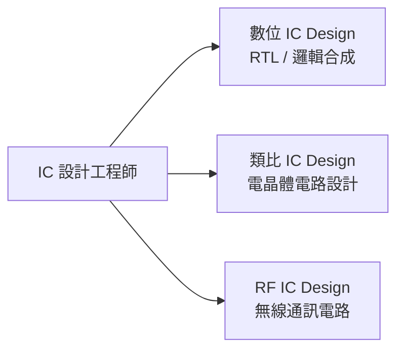
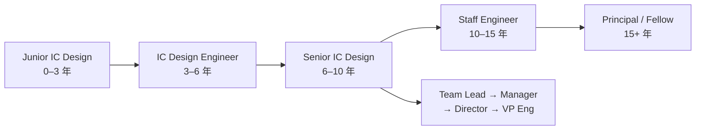

# IC 設計工程師

IC 設計工程師是 Fabless 公司（MediaTek、Novatek、Realtek）以及 NVIDIA、Qualcomm 台灣設計中心的核心職務，也是半導體業薪資最高的職務之一。

## 三大分支

### 數位 IC 設計（Digital IC Design）

**每天在做什麼：**
- 用 Verilog / SystemVerilog 寫 RTL（暫存器轉移層次）描述硬體行為
- 用 Synopsys Design Compiler 或 Cadence Genus 做邏輯合成
- 分析 PPA（Power, Performance, Area）三角取捨
- 處理跨時脈域（CDC）、重設策略、低功耗設計（UPF）
- 和物理設計團隊對齊 Floorplan 約束

**核心技能：**
- Verilog / SystemVerilog / VHDL
- 邏輯合成工具（DC、Genus）；靜態時序分析（PrimeTime）
- CPU / GPU / AI 加速器微架構（2024–2025 年加分項）

### 類比 IC 設計（Analog IC Design）

**每天在做什麼：**
- 設計電晶體等級電路：運算放大器、PLL、ADC/DAC、LDO、帶隙基準
- 用 Spectre / HSPICE 做 SPICE 模擬，across PVT corners 驗證
- 手動 Layout 關鍵元件（匹配、遮蔽路由）
- 噪音、失配、穩定性分析

**核心技能：**
- Cadence Virtuoso（電路圖 + 模擬）
- 深厚的 CMOS 元件物理知識
- ESD 設計、製程角（Process Corner）理解

### RF IC 設計

**每天在做什麼：**
- 設計放大器、混頻器、VCO、濾波器（5G、Wi-Fi、藍牙應用）
- 電磁模擬（EM simulation）；S 參數、雜訊指數、線性度分析

## 職涯發展

## 主要雇主（台灣）

| 公司類型 | 代表公司 |
|---------|---------|
| 台灣 Fabless | MediaTek（聯發科）、Novatek（聯詠）、Realtek（瑞昱）、Silicon Motion（慧榮）、Phison（群聯）|
| 國際大廠台灣中心 | NVIDIA Taiwan、Qualcomm Taiwan、Marvell、Broadcom、Apple ATSC |
| 設備 / EDA 設計部 | TSMC（IP / 標準元件庫設計）|

## 學歷門檻

- 碩士（MSEE）為主流入職門檻；知名學校（台大、清大、交大 / 陽明交大）競爭優勢明顯
- 博士可直接進入資深職級，升遷路徑較快
- MediaTek、Novatek 的 IC 設計職缺幾乎只招碩士以上

## 薪資（2024–2025 估計）

| 職級 | 年總酬勞（TWD） |
|------|-------------|
| 新鮮人（碩士，台灣 Fabless） | NT$1.2M – NT$1.8M |
| 新鮮人（NVIDIA / Qualcomm TW） | NT$1.8M – NT$2.5M |
| 資深（5–8 年） | NT$2.5M – NT$5M |
| Staff（10+ 年） | NT$4.5M – NT$8M+ |
| Principal / Fellow | NT$8M – NT$15M+ |

> 包含年終獎金（MediaTek 好年份可達 6–12 個月）與 RSU 股票
