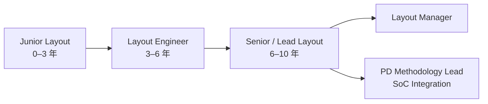

# Layout / 實體設計工程師

Layout 工程師（又稱 Physical Design Engineer）把電路設計師的電路圖「翻譯」成矽晶片上的幾何圖形。這是晶片能不能真正生產出來的最後一道設計關卡。

## 兩大分支

### 類比 Layout（Analog Layout Engineer）
- 接收類比設計師的電路圖，用 Cadence Virtuoso 手動排列電晶體
- 關鍵技術：共心排列（Common-Centroid）、交叉配對（Interdigitation）確保匹配
- 敏感訊號遮蔽路由、管理寄生電容/電阻
- 必須通過 DRC（設計規則檢查）與 LVS（Layout vs Schematic 一致性）

### 數位 P&R（Physical Design / Place & Route）
- 用 Cadence Innovus 或 Synopsys IC Compiler 2 做自動化佈局佈線
- Floorplanning → Power Grid → Clock Tree Synthesis（CTS）→ 時序收斂（Timing Closure）
- 用 Calibre 做 DRC / LVS / 天線效應檢查
- 用 Quantus / StarRC 萃取寄生參數後回饋設計師

## 核心技能

| 類型 | 工具 | 技術 |
|------|------|------|
| 類比 Layout | Cadence Virtuoso, Calibre | DRC/LVS, FEOL/BEOL 製程層理解 |
| 數位 P&R | Cadence Innovus, Synopsys ICC2 | 時序分析（PrimeTime）, 功耗意圖（UPF）|
| 共同 | Python, Tcl, SKILL 腳本 | 自動化流程、rule deck 管理 |

**FinFET 特殊限制**（7nm/5nm/3nm 節點）：
- Fin 對齊規則、Gate 間距規則極為嚴格
- 每個 via 的放置都有方向限制
- 需要 DFM（Design for Manufacturability）規則知識

## 職涯發展

## 主要雇主

- 全數 Fabless 公司（MediaTek、Novatek 都有大型 Layout 團隊）
- Design Service 公司：Global Unichip（GUC，台積電旗下）、eMemory
- TSMC 本身（標準元件庫、I/O cell、ESD cell 的 Layout）

## 薪資（2024 估計）

| 職級 | 年總酬勞（TWD） |
|------|-------------|
| 新鮮人（0–3 年） | NT$900K – NT$1.4M |
| 資深（5–8 年） | NT$1.8M – NT$3M |
| Lead / Staff（10+ 年） | NT$3M – NT$5M |

> 類比 Layout 因缺人，薪資近年有上漲趨勢；頂尖 Analog Layout Engineer 可達 NT$4M+
