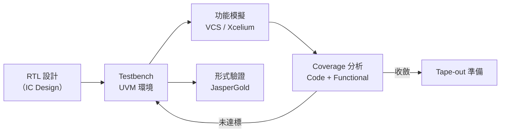
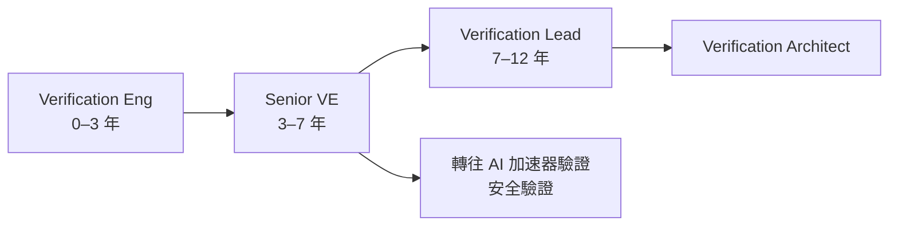

# 驗證工程師

驗證工程師（Verification Engineer / DV Engineer）負責在晶片出廠前找出所有設計 Bug。隨著 AI SoC 複雜度爆增，驗證工作量往往佔整個晶片設計週期的 **60–70%**。

## 核心工作

**每天在做什麼：**
- 用 SystemVerilog + UVM（Universal Verification Methodology）寫測試環境
- 建立 Coverage model（Cover Groups、Bins）確保所有設計情境都被測到
- 用 VCS（Synopsys）或 Xcelium（Cadence）跑數千萬 cycle 模擬找 Bug
- 用 JasperGold / VC Formal 做形式驗證（Property Checking）
- 把 RTL 移植到 Palladium / Veloce 硬體模擬平台加速驗證
- Silicon Bring-up：矽晶片回來後用示波器、JTAG debugger 驗證真實行為
- 建立 Bug 報告、追蹤 Coverage 收斂進度

## 核心技能

- SystemVerilog、UVM（必備）
- 模擬工具：VCS、Xcelium、ModelSim
- 形式驗證：JasperGold（Cadence）、VC Formal（Synopsys）
- C/C++、Python（testbench 自動化）
- 通訊協定知識：AXI、PCIe、USB、DDR、Ethernet（依工作領域）
- FPGA 經驗（Vivado / Quartus）加分

## 職涯發展

## 主要雇主

- **MediaTek**（台灣最大 VE 團隊，驗證複雜手機 / AI SoC）
- Novatek（顯示驅動 IC）、Realtek（網路 / 音訊）
- NVIDIA Taiwan、Qualcomm Taiwan（龐大驗證團隊）
- TSMC（驗證自家 IP：標準元件庫、I/O）

## 薪資（2024 估計）

| 職級 | 年總酬勞（TWD） |
|------|-------------|
| 新鮮人（碩士） | NT$1.0M – NT$1.6M |
| 資深（5–8 年） | NT$2.0M – NT$4.0M |
| Staff / Lead（10+ 年） | NT$4.0M – NT$7M |

> AI 相關晶片的 Verification Engineer 薪資近年顯著上漲，供不應求
