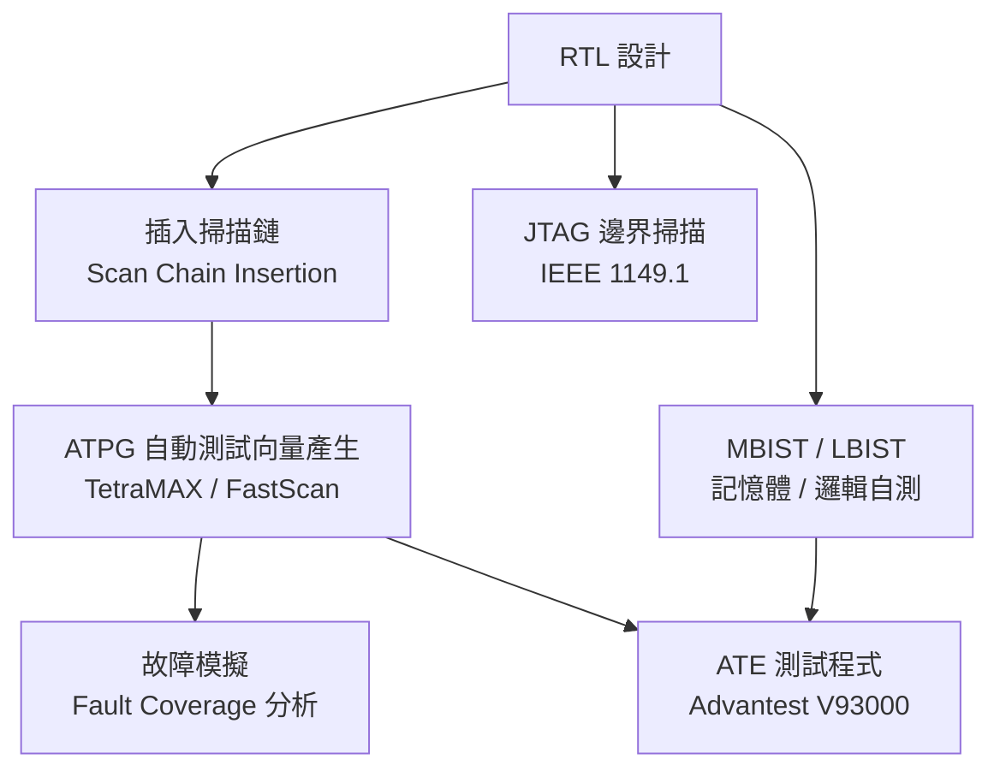
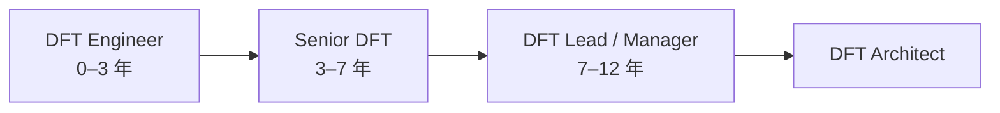

# DFT 工程師

DFT（Design for Testability，可測試性設計）工程師讓晶片在出廠後能被自動化測試設備（ATE）有效測試。如果 IC 設計師負責讓晶片能「正常運作」，DFT 工程師負責讓晶片能被「證明正常」。

## 核心工作

**每天在做什麼：**
- 用 Synopsys DFT Compiler 或 Mentor Tessent 在 RTL 中插入掃描鏈
- 產生 ATPG 測試向量，目標 Stuck-at / Transition Fault Coverage ≥98%
- 設計 MBIST（記憶體內建自測電路），特別重要於含大量 SRAM 的 AI 晶片
- 定義 TAP Controller（JTAG）架構
- 與測試廠（Advantest、Teradyne）協作將向量轉換成 ATE 格式
- Chiplet / 2.5D 封裝：設計 Die-to-Die 的測試基礎設施

## 核心技能

- **工具**：Synopsys DFT Compiler、Mentor Tessent（最常用）
- **故障模型**：Stuck-at、Transition、Path Delay、Bridging Fault
- **ATPG 方法論**：Full Scan、Partial Scan、Compression（X-Press）
- Perl / Python / Tcl 腳本自動化
- ATE 平台：Advantest V93000（台灣主流）、Teradyne UltraFLEX

## 職涯發展

## 主要雇主

- **MediaTek**（台灣最大 DFT 需求，SoC 複雜度高）
- TSMC（自家 IP 與客戶合作）
- Novatek、Realtek、Silicon Motion
- 測試設備商：Advantest Taiwan、Teradyne Taiwan

## 薪資（2024 估計）

| 職級 | 年總酬勞（TWD） |
|------|-------------|
| 新鮮人（碩士） | NT$1.0M – NT$1.5M |
| 資深（5–8 年） | NT$2.0M – NT$3.5M |
| Lead / Staff（10+ 年） | NT$3.5M – NT$6M |

> DFT 人才**極度稀缺**，供需嚴重失衡，2024–2025 年薪資上漲明顯
