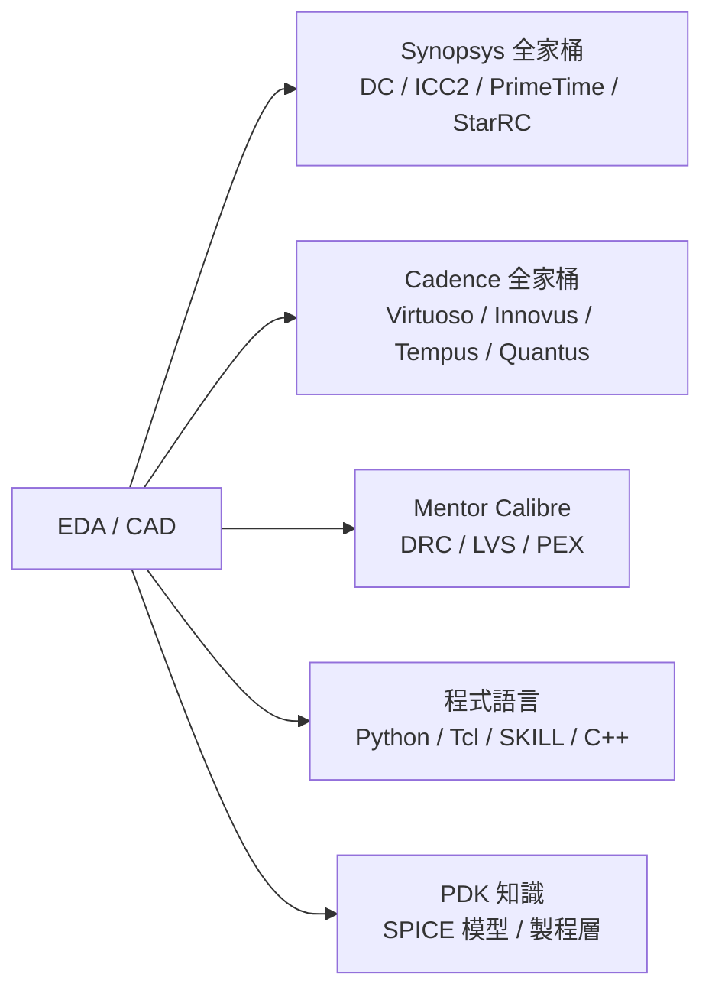

# EDA / CAD / PDK 工程師

EDA（Electronic Design Automation）工程師讓數千名 IC 設計師能順暢使用設計工具。他們不直接設計晶片，而是打造設計師依賴的「基礎設施」。

## 三個子角色

### EDA / CAD 工程師（設計公司端）
在 MediaTek、Novatek 等公司的 DM（Design Methodology）或 CAD 團隊：
- 評估與部署新版 EDA 工具（Synopsys DC、Cadence Innovus）
- 建立與維護設計流程（Design Flow）；寫自動化腳本
- 管理 EDA 授權（License Pool）
- 幫設計師解決工具問題；開發 Custom 腳本加速流程

### PDK 工程師（台積電 / 聯電）
PDK（Process Design Kit）是每個製程節點的「說明書」：包含 SPICE 模型、DRC 規則、Pcell（參數化元件）、Display Layer⋯⋯所有設計師開始畫電路前都需要的工具。

**每天在做什麼：**
- 與製程 / 元件工程師協作，萃取 SPICE 模型（N3 / N2 的 BSIM-IMG）
- 在 Cadence Virtuoso 設定製程層顯示規則（Display Layer）
- 用 Calibre 語言撰寫 DRC / LVS 規則集
- 建立 Parameterized Cell（PCell）—— 讓設計師可以快速放置可調參數的電晶體
- 是 Process 工程師與 IC 設計師之間的橋接人

### EDA 軟體開發工程師（Synopsys / Cadence / Siemens EDA）
- 開發 EDA 工具本身（C++）
- 修復工具 Bug；新增功能
- 支援客戶（TSMC、MediaTek）的工具採用問題

## 核心技能

## 薪資（2024 估計）

| 公司類型 | 年總酬勞（TWD） |
|---------|-------------|
| Synopsys / Cadence Taiwan | NT$1.2M – NT$3.5M |
| TSMC CAD / PDK 團隊 | NT$1.5M – NT$4.0M |
| MediaTek DM（設計方法論）團隊 | NT$2.0M – NT$5.0M |

> MediaTek DM 因工作內容與 IC Design 高度相關，薪資接近設計工程師
