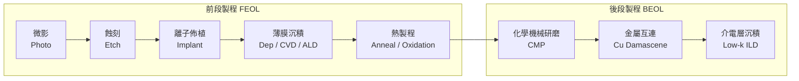

# 製程工程師總覽

製程工程師（Process Engineer）在晶圓廠的無塵室裡，負責半導體製造中每一道工序的開發、最佳化與日常監控。這是台積電、聯電雇用人數最多的工程師類別。

## 半導體製程流程

## 製程工程師的日常

**工作環境特點：**
- 需穿無塵衣（Bunny Suit）在 Class 10 / Class 1 無塵室工作
- **12 小時輪班**（包含夜班）是台積電 / 聯電的標準配置
- 下班後仍可能接到緊急電話（製程異常、設備當機）

**核心日常任務：**
- 監控 SPC（Statistical Process Control）管制圖，及時發現製程偏移
- 製程異常時：隔離受影響的 Lot，做根本原因分析（RCA），執行改善措施
- 開發並驗證新製程配方（Recipe）；設計實驗（DOE）
- 與設備工程師合作確保多台相同設備的製程一致性（Tool Matching）
- 撰寫和更新標準作業流程（SOP）
- 支援新製程導入（NPI，New Product Introduction）

## 製程工程師專長分類

| 專長 | 關鍵設備 | 技術重點 | 對應頁面 |
|------|---------|---------|---------|
| 微影（Photo） | ASML EUV/DUV、TEL Track | 曝光劑量、對準、光阻製程 | [微影工程師](07-photo.md) |
| 蝕刻（Etch） | Lam Research、AMAT | 電漿蝕刻、選擇比、CD 控制 | [蝕刻/薄膜/CMP](08-etch-dep-cmp.md) |
| 薄膜沉積（Dep） | AMAT、Lam、TEL | CVD / ALD / PVD、膜厚均勻性 | [蝕刻/薄膜/CMP](08-etch-dep-cmp.md) |
| CMP | AMAT Reflexion | 去除速率、均勻性、刮傷 | [蝕刻/薄膜/CMP](08-etch-dep-cmp.md) |
| 整合（Integration） | 跨模組 | 全製程流程、元件特性 | [整合工程師](09-integration.md) |

## 需要的背景

- 碩士（MSEE / 材料 / 化工 / 物理）為主，博士優先（整合 / R&D 職位）
- 半導體物理、CMOS 製程流程基礎
- 統計分析（JMP、Minitab）；DOE 方法論
- 願意接受輪班制

## 薪資（2024 估計，台積電）

| 職級 | 年總酬勞（TWD） | 備註 |
|------|-------------|------|
| 新鮮人（學士/碩士） | NT$700K – NT$1.1M | 含輪班津貼 |
| 資深（5–8 年） | NT$1.2M – NT$2.0M | |
| Section Manager（8–12 年） | NT$2.0M – NT$3.5M | |
| Module / 部門主管 | NT$3.5M – NT$6M+ | |

> 台積電另有宿舍補貼（竹科）、餐廳、接駁車、法定年終（約 2 個月）+ 績效獎金
