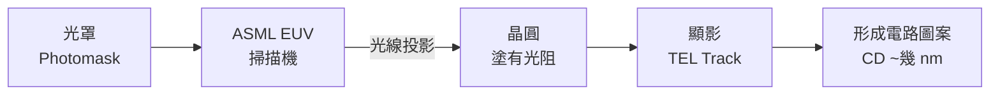

# 微影工程師

微影工程師（Photo Engineer / Lithography Engineer）負責半導體製造中最關鍵、技術門檻最高的一道工序——把電路圖案「投影」到晶圓上。在 3nm/2nm 先進製程中，EUV 微影是台積電最核心的競爭壁壘之一。

## 微影的原理

## 核心工作

**每天在做什麼：**
- 操作和最佳化 ASML EUV / DUV 掃描機及 TEL 塗佈顯影機台
- 最佳化曝光劑量（Dose）、焦距（Focus）、對準（Overlay Alignment）
- 管理光阻製程：塗佈（Coating）→ 曝光（Exposure）→ 軟烤（PEB）→ 顯影（Develop）
- **EUV 特有挑戰**：隨機缺陷（Stochastic Defects）管理——EUV 光子數少，統計波動導致 CD 變異
- 用計算微影（Computational Lithography / OPC）工具做光學鄰近效應修正

## EUV vs DUV

| 特性 | EUV（極紫外光） | DUV（深紫外光） |
|------|--------------|--------------|
| 波長 | 13.5 nm | 193 nm（ArF 沉浸式）|
| 應用節點 | 7nm 以下（5nm/3nm/2nm） | 28nm 以上（部分 14nm/10nm）|
| 功率需求 | ~250W 光源，耗電量極大 | 相對較低 |
| 光罩 | 反射式光罩（無法直接碰觸）| 透射式光罩 |
| 設備廠商 | 只有 ASML | ASML、Nikon、Canon |
| 對準精度 | < 1 nm Overlay | ~2–5 nm Overlay |

## 為什麼微影工程師珍貴

1. **ASML 機台極貴**：一台 ASML High-NA EUV 機台售價超過 **4 億美元**，全台灣只有台積電能買
2. **知識壁壘高**：需同時懂光學、光阻化學、精密機械、統計製程控制
3. **需要 ASML 原廠培訓**：與 ASML FAE 深度協作，部分人才在 ASML 和台積電間流通
4. **最先進節點的核心**：N3/N2/A16 製程的良率高低，Photo 工程師是關鍵決定者

## 薪資（2024 估計）

| 職級 | 年總酬勞（TWD）|
|------|-------------|
| TSMC Photo Engineer（新鮮人） | NT$800K – NT$1.1M |
| TSMC Photo Engineer（資深） | NT$1.5M – NT$2.5M |
| ASML Application Engineer（合作方） | NT$2.5M – NT$5M+ |

> ASML AE 支援台積電微影製程，薪資為台灣工程師頂端

相關：[ASML FAE 職務說明](17-fae.md) | [製程工程師總覽](06-process-overview.md)
