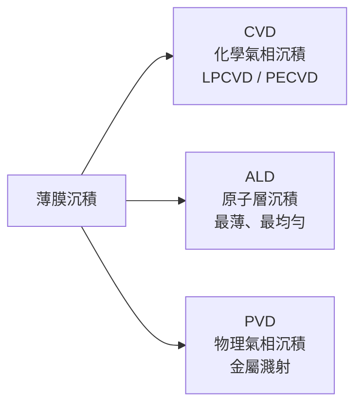
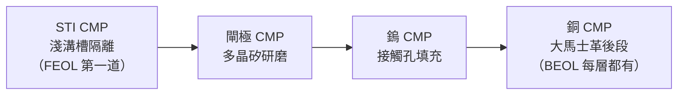

# 蝕刻 / 薄膜沉積 / CMP 工程師

這三個專長涵蓋晶圓製造中圖案成形（蝕刻）、材料添加（沉積）與表面平坦化（CMP）的核心工序，是晶圓廠人力需求量最大的製程類別。

## 蝕刻工程師（Etch Engineer）

### 原理
電漿蝕刻用帶能量的離子和自由基，選擇性地去除晶圓上的特定材料（矽、氧化物、金屬等），把光罩上的圖案轉移到下方材料。

**每天在做什麼：**
- 調整電漿配方（Gas Flow、RF Power、壓力、溫度）達到目標 CD（Critical Dimension）
- 控制蝕刻選擇比（Selectivity）：只蝕刻目標層，不傷害遮罩層
- 監控均勻性（Within-Wafer Uniformity）；分析 SPC 資料
- 主要設備：**Lam Research** Kiyo、Flex 系列；**Applied Materials** Centura

### 3nm / 2nm 挑戰
- 高深寬比（HAR）蝕刻：接觸孔（Contact Hole）深寬比 >10:1，要求極高各向異性
- Atomic Layer Etch（ALE）：原子層精度蝕刻，用於最先進節點

## 薄膜沉積工程師（Deposition Engineer）

### 三種沉積方式

| 方式 | 特點 | 應用 |
|------|------|------|
| CVD / PECVD | 速率快、覆蓋性好 | 介電層（SiO₂、SiN、Low-k ILD）|
| ALD | 原子層精度、共形覆蓋 | High-k Gate（HfO₂）、Ru/Co 金屬 |
| PVD / Sputter | 金屬薄膜 | 阻障層（TaN）、銅種子層、鋁 |

**主要設備商：** Applied Materials（AMAT）、Lam Research、Tokyo Electron（TEL）

**每天在做什麼：**
- 最佳化膜厚均勻性（Within-Wafer, Wafer-to-Wafer）
- 監控薄膜應力（Compressive / Tensile）：會影響元件特性和翹曲
- 電性特性量測（介電常數 k、漏電流、崩潰電壓）
- 缺陷（Particle）管理，尤其對 ALD 薄膜的針孔（Pinhole）缺陷

## CMP 工程師（Chemical Mechanical Planarization）

CMP 是用化學漿料（Slurry）加上機械研磨墊，把晶圓表面磨平，為下一道光刻層提供平坦表面。

**每天在做什麼：**
- 最佳化研磨速率（Removal Rate）與均勻性
- 控制 Dishing（金屬線凹陷）與 Erosion（絕緣層過度研磨）
- 管理研磨墊（Pad）更換週期；調劑漿料濃度與流量
- 主要設備：Applied Materials Reflexion GTn、Ebara

### CMP 關鍵應用點

## 薪資與雇主

| 職位 | 雇主 | 新鮮人年薪 | 資深年薪 |
|------|------|----------|---------|
| 蝕刻工程師 | TSMC、UMC | NT$800K–1.1M | NT$1.5M–2.5M |
| 薄膜沉積工程師 | TSMC、UMC | NT$800K–1.1M | NT$1.5M–2.5M |
| CMP 工程師 | TSMC、UMC | NT$700K–1.0M | NT$1.3M–2.2M |
| Etch AE（Lam / AMAT） | Lam Research TW、AMAT TW | NT$1.2M–2.0M | NT$2.5M–4M |
