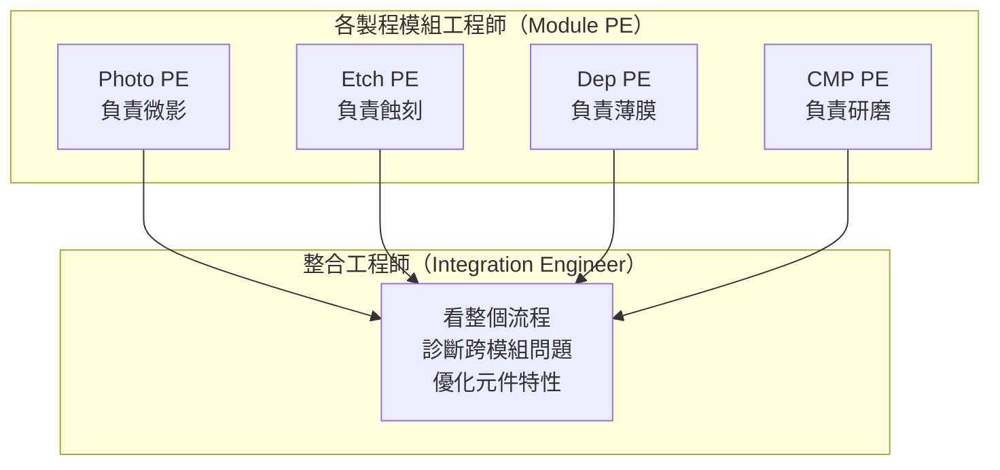
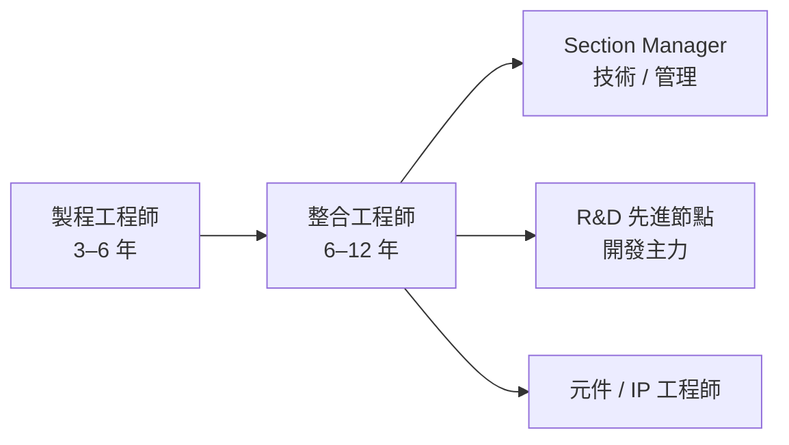

# 整合工程師

整合工程師（Integration Engineer）是製程類職務中技術層次最高的角色，通常是博士或資深碩士工程師擔任。他們不擁有單一製程步驟，而是負責「全局」——確保所有製程步驟組合在一起後，元件特性能達到規格。

## 與其他製程工程師的差異

單一製程工程師只看自己那一道工序。整合工程師必須跨越所有工序，找出「A 工序的改變如何影響 C 工序的元件特性」。

## 核心工作

**每天在做什麼：**
- 診斷跨製程模組的良率問題（例如：Vt 偏移，但哪道製程造成的？）
- 分析元件特性：Vt（閾值電壓）、DIBL、GIDL、次閾值斜率、漏電流、驅動電流
- 設計整合實驗（Integration DOE）：改變多個製程參數，觀察元件特性變化
- 橋接製程工程師和元件工程師 / 良率工程師
- 在新製程節點（如 N2）開發中，整合工程師是核心 R&D 人員

## 所需背景

- **博士學位**（電機、物理、材料）是台積電整合工程師的實際主流
- 深厚的半導體元件物理（MOSFET 特性、短通道效應）
- 熟悉 TCAD 模擬工具（Sentaurus、Silvaco）：用模擬預測製程改變的影響
- 統計分析能力（多變量分析、DOE 設計）

## 職涯路徑

整合工程師通常是技術路線中的高階職位，不是剛入職的起點：

## 主要雇主

- **台積電**：整合工程師是推進每個新製程節點（N3/N2/A16）的核心人才
- **聯電**：28nm/22nm 製程整合
- 偶爾：ITRI（工研院）、各大學半導體研究室（偏學術）

## 薪資（2024 估計）

| 職級 | 年總酬勞（TWD）|
|------|-------------|
| Junior Integration（博士直招） | NT$1.5M – NT$2.0M |
| Senior Integration | NT$2.5M – NT$4.0M |
| Section Manager | NT$3.5M – NT$6M |

> 整合工程師的薪資顯著高於同年資的其他製程工程師，反映其稀缺性
