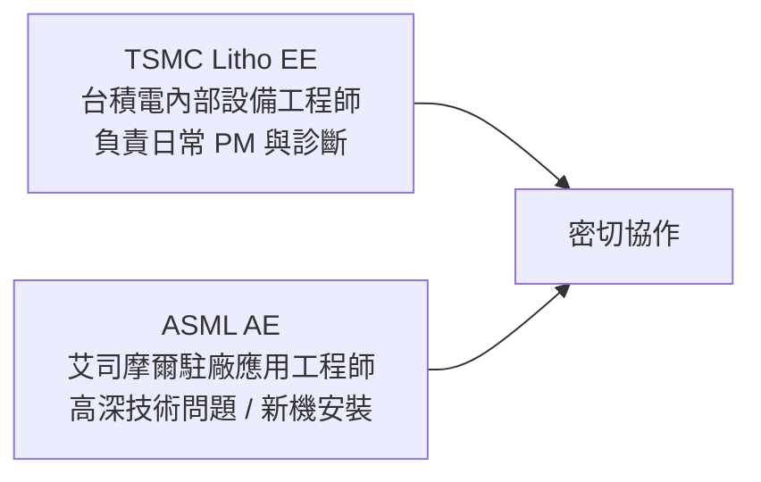

# 設備工程師

設備工程師（Equipment Engineer / 機台工程師）負責維護半導體製造設備的正常運作。晶圓廠的核心資產是機台，而設備工程師就是守護這些動輒數億美元設備的人。

## 核心職責

**每天在做什麼：**
- 執行預防性保養（PM，Preventive Maintenance）：定期更換腔體零件（Chamber Liner、Ring、電極）
- 機台當機時：從系統日誌、感測器資料找出根本原因；聯繫設備商（OEM）工程師；最小化停機時間
- 追蹤 OEE（Overall Equipment Effectiveness）：設備稼動率指標
- 保養後重新校準製程參數，確保回到基準線（Baseline）
- 與製程工程師合作做「機台匹配（Tool Matching）」：確保多台相同設備產出一致的製程結果
- 管理設備耗材庫存（零件採購、庫存水位）

## 設備專長分類

| 專長 | 主要設備廠商 | 技術特點 |
|------|-----------|---------|
| **微影設備（Litho EE）** | ASML | 最技術密集；需 ASML 原廠培訓；光機電整合 |
| **蝕刻設備（Etch EE）** | Lam Research, AMAT | RF 電源、真空系統、電漿診斷 |
| **薄膜設備（Thin Film EE）** | AMAT, Lam, TEL | 加熱系統、氣體流量控制、真空腔體 |
| **CMP 設備（CMP EE）** | AMAT Reflexion, Ebara | 機械研磨、漿料系統、墊片調整 |
| **量測設備（Metrology EE）** | KLA, Hitachi | 缺陷檢測儀、CD-SEM、Overlay 量測 |

## Litho 設備工程師的特殊地位

ASML EUV 掃描機是全球最複雜的商用設備之一（含 ~10 萬個零件）。台灣的 Litho EE 分兩種來源：

## 工作條件

- **12 小時輪班制**（台積電 / 聯電）：包括夜班
- 需穿戴無塵衣、手套、護目鏡（在無塵室工作）
- 部分保養需在密閉空間作業或處理特殊氣體（需 MSDS 訓練）
- 體力需求：需長時間站立、搬運設備零件

## 學歷與技能需求

- 學士 / 碩士：機械工程、電機工程、化工、材料
- 能看懂設備配管圖、氣動圖、電路圖
- 基本電子量測技能（示波器、萬用電表）
- 英文：設備文件、與 OEM 溝通需要

## 薪資（2024 估計）

| 職位 | 年總酬勞（TWD） |
|------|-------------|
| TSMC 設備工程師（新鮮人） | NT$700K – NT$1.0M |
| TSMC 設備工程師（資深） | NT$1.2M – NT$2.0M |
| Section Manager | NT$2.0M – NT$3.0M |
| **ASML Application Engineer** | NT$2.5M – NT$5M（顯著溢價）|
| Lam / AMAT / KLA AE | NT$1.5M – NT$4M |
