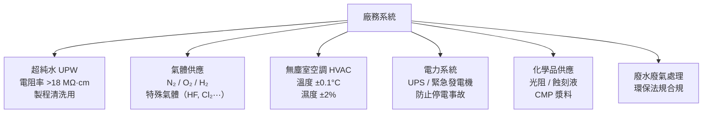

# 廠務工程師

廠務工程師（Facilities Engineer）負責維護晶圓廠建築基礎設施——水、電、氣、空調。沒有穩定的廠務系統，晶圓廠就無法運作。任何廠務中斷都可能造成晶圓大量報廢，損失動輒數億台幣。

## 廠務系統範疇

## 與設備工程師的差異

| | 廠務工程師 | 設備工程師 |
|-|-----------|-----------|
| 管理對象 | 建築基礎設施（水電氣） | 製程生產設備（機台）|
| 無塵室內工作 | 部分（管道間、機房） | 大量（清潔室工作） |
| 緊急應變 | 停水 / 停電 / 氣體洩漏 | 機台當機 / 製程異常 |
| 法規要求 | 環保、消防、工安法規 | 設備安全規範 |

## 核心技能

- 機械工程 / 化學工程 / 電機工程背景
- 流體力學（管路設計）、熱力學（空調系統）
- 高壓電氣安全（台電供電、變壓器、UPS）
- 特殊氣體安全：HF（氫氟酸）、Cl₂（氯氣）等劇毒化學品的洩漏應變
- PLC 控制系統（廠務 SCADA 監控）

## 7×24 on-call 文化

廠務系統必須 24 小時運作，工程師需要 on-call 待命。特別是：
- **停電事件**：UPS 切換、緊急發電機啟動
- **特殊氣體洩漏**：安全疏散與緊急關閉程序
- **UPW 水質異常**：可能導致整個晶圓廠停產

## 薪資（2024 估計）

| 職級 | 年總酬勞（TWD）|
|------|-------------|
| 新鮮人（學士 / 碩士） | NT$700K – NT$1.0M |
| 資深（5–8 年） | NT$1.2M – NT$2.0M |
| Section Manager | NT$2.0M – NT$3.0M |

> 廠務與設備工程師薪資相近；因輪班津貼，實際收入高於帳面月薪
