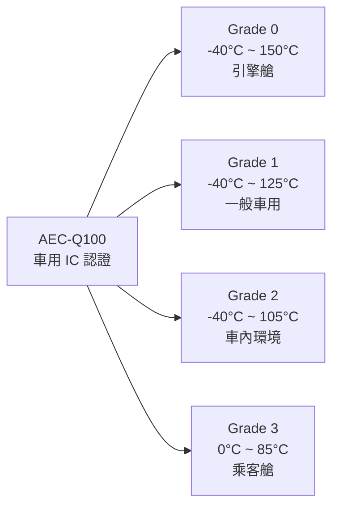

# QA / 品質工程師

品質工程師（Quality Assurance Engineer / 品保工程師）確保半導體產品符合規格並滿足客戶要求，特別是在車用半導體領域，品質要求極為嚴苛。

## 主要工作

**每天在做什麼：**
- 監控製造品質指標：缺陷密度、顆粒污染、在線檢測資料
- 處理客訴：接收客戶品質問題 → 協調內部調查 → 提交 8D 報告 → 執行改善措施（CAPA）
- 維護品質管理系統（QMS）認證：IATF 16949（車用）、ISO 9001
- 統計抽樣檢驗：定義 AQL（Acceptable Quality Level）
- 車用產品：PPAP（生產件批准程序）、FMEA（失效模式與效應分析）

## 車用半導體的特殊要求

車用晶片（AEC-Q100 標準）比消費電子要求嚴格 10–100 倍：

## 核心技能

- MSEE 或工程背景 + 經驗；六標準差（Green Belt / Black Belt）加分
- IATF 16949、ISO 9001、AEC-Q 系列標準
- SPC 工具（JMP、Minitab）；FMEA 方法論；8D 問題解決
- 雙語（中英文）：需與國際客戶溝通

## 薪資（2024 估計）

| 職級 | 年總酬勞（TWD）|
|------|-------------|
| 新鮮人 | NT$800K – NT$1.2M |
| 資深（5–8 年） | NT$1.5M – NT$2.5M |

> QA 薪資通常低於設計 / 製程工程師，但車用 QA 因認證門檻較高，薪資相對較好
