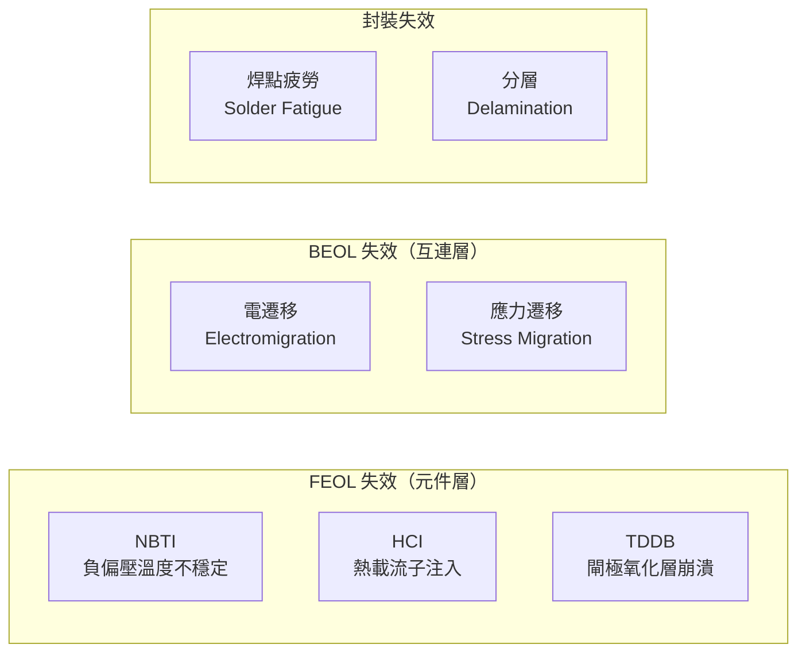

# 可靠度工程師

可靠度工程師（Reliability Engineer）負責評估半導體產品的壽命，確保晶片在客戶手中能可靠運作數年乃至數十年——不能說產品符合規格，還要說「10 年後仍有 99.9% 機率正常運作」。

## 核心工作

**每天在做什麼：**
- 執行加速壽命測試（Accelerated Life Testing）：
  - **HTOL**（High Temperature Operating Life）：高溫運作壽命測試
  - **HAST**（Highly Accelerated Stress Test）：高溫高濕，加速封裝失效
  - **ELFR**（Early Life Failure Rate）：早期失效率篩選
  - **ESD / Latch-up**：靜電與閂鎖測試
- Weibull 統計分析：從加速測試結果推算正常使用條件下的壽命（MTTF）
- 定義降額準則（Derating Guidelines）
- 與 IC 設計師合作改善 ESD 保護電路
- 與 FA 工程師合作分析退貨品

## 失效物理（Physics of Failure）

可靠度工程師需要理解各種失效機制背後的物理：

## 核心技能

- MSEE / 物理 / 材料碩士；車用領域需 AEC-Q100/101 認證知識
- **Weibull 分析**、對數正態分佈；JMP / Minitab / Reliasoft 軟體
- JEDEC JESD22 系列測試規範；AEC-Q100（車用 IC）
- 熱腔、燒機板、參數測試設備的操作

## 主要雇主

TSMC、UMC、ASE、MediaTek、Realtek、Novatek；車用晶片公司：NXP Taiwan、Renesas Taiwan、Infineon Taiwan

## 薪資（2024 估計）

| 職級 | 年總酬勞（TWD）|
|------|-------------|
| 新鮮人 | NT$1.0M – NT$1.4M |
| 資深（5–8 年） | NT$1.8M – NT$3.0M |
| Lead（10+ 年） | NT$3.0M – NT$5M |
