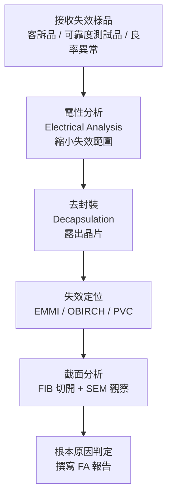

# 失效分析工程師

失效分析工程師（Failure Analysis Engineer / FA Engineer）是半導體業的「法醫」——他們接到一顆壞掉的晶片，用各種高端分析儀器找出哪裡壞了、為什麼壞，並給出根本原因。

## FA 的工作流程

## 主要分析工具

| 工具 | 全名 | 用途 |
|------|------|------|
| **SEM** | Scanning Electron Microscope | 奈米等級缺陷成像 |
| **TEM** | Transmission Electron Microscope | 原子解析度截面分析 |
| **FIB** | Focused Ion Beam | 定點切面 + 電路修改（Circuit Edit）|
| **EMMI** | Emission Microscopy | 偵測漏電點（光子發射）|
| **OBIRCH** | Optical Beam Induced Resistance Change | 定位高阻路徑 |
| **EDS / SIMS / XPS** | 各類能譜分析 | 元素分析（找污染物）|

## 為什麼 FA 工程師珍貴

1. **儀器昂貴**：一台 TEM 要價 300–500 萬美元，FIB-SEM 組合也要 100–200 萬美元
2. **技術複雜**：需同時懂半導體製程、電性分析、材料科學、儀器操作
3. **缺乏人才**：會操作 TEM 做 FA 的工程師供不應求
4. **TSMC 的戰略角色**：TSMC 的 FA 工程師直接支援客戶（Apple、NVIDIA）的晶片失效問題，是維繫客戶關係的關鍵

## 核心技能

- MSEE / 材料科學 / 物理碩士
- SEM、TEM、FIB 操作（通常需要 1–2 年培訓才能獨當一面）
- 半導體製程流程全貌理解：能看 TEM 截面圖判斷是哪道製程出問題
- 技術寫作（FA 報告需清晰傳達給客戶）

## 主要雇主

TSMC（最大 FA 團隊）、UMC、ASE、ITRI（工研院）、各 Fabless 公司的後端分析部門

## 薪資（2024 估計）

| 職級 | 年總酬勞（TWD）|
|------|-------------|
| 新鮮人 | NT$900K – NT$1.2M |
| 資深（5–8 年） | NT$1.5M – NT$2.5M |
| 高階 TEM / FIB 專家 | NT$3M – NT$5M（稀缺溢價）|
